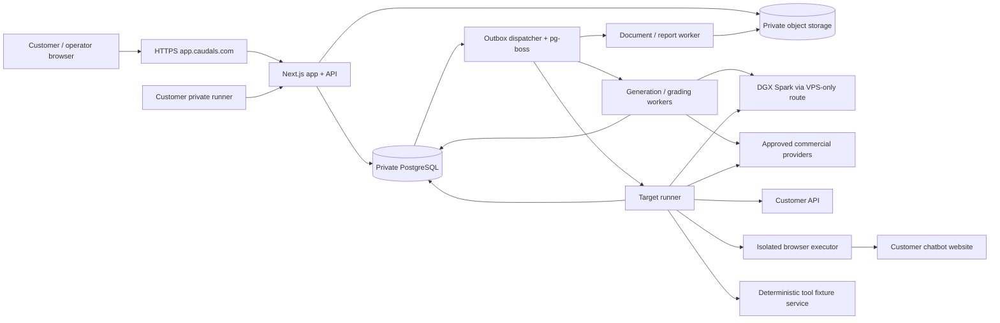

# Caudals Evaluations — Product and Technical Implementation Specification

> Status: **Draft v0.1 for founder iteration — implementation has not started.**
> Date: 2026-09-17 · Product language: English · Deployment: `app.caudals.com`
> Repository: `Caudals/caudals` · Audience: founders, implementation agents, reviewers.
> This document specifies the new evaluations product from first principles. Earlier offers, sector priorities, manual-pilot prerequisites, route restrictions and proposed evaluation architectures are not requirements for this product. Existing production services must continue working.

> [!IMPORTANT]
> **CRITICAL DIRECTIVE FOR ALL AI AGENTS: DO NOT USE SUBAGENTS**
> Any AI agent (Antigravity, Claude Code, Codex, etc.) reading or implementing this specification **MUST NOT** spawn subagents, invoke subagent tools (e.g. `invoke_subagent`), or delegate tasks to child/background agents. Execute all analysis, code changes, testing, and tool executions directly within your own primary session context.

Reading map: [product and UX](#2-product-definition-and-success-criteria) · [architecture](#7-architecture-and-repository-integration) · [connections](#8-connection-framework) · [generation](#9-context-ingestion-and-dataset-generation) · [CEF standard](#10-caudals-evaluation-format--cef-10) · [execution and scoring](#11-evaluation-engine-grading-and-statistics) · [costs](#14-model-infrastructure-and-budget-control) · [operations](#17-vps-development-deployment-and-operations) · [work packages](#20-implementation-stages-and-work-packages) · [agent handoff](#21-agent-execution-protocol-and-handoff-template).

## 1. How agents must use this document

1. Read sections 2–5, the invariants in section 6, and the work package being implemented before editing code.
2. Implement one work package or an explicitly assigned sub-package at a time. Follow its dependencies, deliverables and acceptance criteria.
3. Treat **MUST** as mandatory, **SHOULD** as the default unless an alternative is justified in a decision record, and **LATER** as outside the initial release.
4. The product decisions below are proposed defaults unless identified as founder-confirmed. They are concrete enough to implement after this specification is accepted; do not silently substitute a different stack or workflow.
5. Inspect current code, infrastructure and package versions before implementation. Paths marked **proposed** do not exist yet. A document describing a service is not proof it is running.
6. Never mark a package complete from a screenshot, successful build or mocked happy path alone. Supply the package's functional evidence and relevant failure tests.
7. Record decisions, migrations, commands actually executed, verification results and remaining limitations in a package handoff. Do not put secrets or customer material in these records.
8. Update affected repository contracts as their packages ship. This draft does not silently rewrite the existing `AGENTS.md`, product overview, design system or deployment rules.
9. **Never use subagents.** AI agents working on this project must execute all exploration, code changes, testing, and verification directly within their own single session context. Do not invoke subagent tools (e.g., `invoke_subagent`), spawn child agents, or delegate sub-tasks to nested agents. Subagents fragment working memory, lose context across boundaries, complicate verification, and risk unconstrained tool invocation.


### 1.1 Authority and scope

Founder-confirmed:

- Build operator workflows first, followed by customer self-service using the same engine.
- Keep the application in this repository, served on `app.caudals.com`.
- Run databases, queues, storage and evaluation workers centrally on the VPS. Agents develop on that VPS.
- Use the DGX Spark through the VPS-only endpoint `http://192.168.70.19:11434/v1` for internal generation and supported open-source model inference.
- Support company APIs, website chatbots, CLI/private systems, CSV/spreadsheet data, documents, multi-turn conversations and tool-using systems progressively.
- Provide interactive reports, PDF, sharing, comparisons, dataset export and repeat evaluations.
- Keep the customer workflow minimal: connect, wait for preparation, wait for evaluation, inspect results.
- Use an English application interface. Evaluation content can be in other languages.
- Design for eventual freelance expert curation and training-dataset production.
- Treat 500–1,000 per evaluation as a maximum spending envelope, increasing later.

Working assumptions requiring founder review, but not blocking this draft:

- Currency is **EUR**; the initial default hard limit is **€500**, with operator-authorized increases up to **€1,000**. These are spending limits, not customer prices or target costs.
- Development on the VPS uses a separate checkout, development database and private preview on the same machine. Releases use immutable images; agents do not hot-edit files inside running production containers.
- First release is invite-only, commercially sold as a managed evaluation. No public unlimited free runs or payment integration is necessary for launch.
- Initial supported inputs are text and text-bearing documents/spreadsheets. OCR is an explicit later capability; voice/video/image-model evaluation is separate future scope.
- Self-service automatic reports are preliminary by default. Reviewed reports require explicit review and publication criteria.


## 2. Product definition and success criteria

Caudals connects to an AI system, establishes what the system should do, builds an evidence-linked evaluation set, measures its behavior and explains the results in a report that a business owner can act on.

The primary product object is an **evaluation**, not a model playground. A customer should not need to know what a judge, token budget, rubric compiler or inference endpoint is.

### 2.1 Distinct evaluation modes


| Mode               | What is measured                                                            | Evidence boundary                                                                   |
| ------------------ | --------------------------------------------------------------------------- | ----------------------------------------------------------------------------------- |
| Deployed system    | The complete chatbot/agent including its actual retrieval and configuration | Do not attribute failures to its underlying model without supporting traces         |
| Controlled model   | A model with a recorded harness, prompts, context and tools                 | Results apply to that configuration, not all deployments of the model               |
| Imported responses | Previously generated answers or transcripts                                 | Grade those artifacts; latency, identity and execution conditions may be unverified |


A run records one execution mode. **Evidence policy is a separate axis:** `exploratory` or `source_grounded`; individual cases additionally record their review/evidence level. An exploratory run can use any execution mode, and its findings are hypotheses rather than verified accuracy claims. Customer-specific tests use these contracts with their own datasets, permissions and release policies.

### 2.2 First useful release

An operator can create a client without an account, upload source material, connect an API, review generated cases, run a bounded evaluation, resolve disputed judgments, publish an evidence-linked report, export a PDF and share restricted access. A second run preserves the first and shows comparable changes.

### 2.3 Product acceptance targets

- A supported API can be connected with endpoint, credentials and a short purpose description; advanced mappings are operator work.
- A known website connector can start from a URL. Unsupported widgets produce a useful assistance state rather than fabricated compatibility.
- Reloading or closing the browser never stops a run or loses progress.
- Every reported failure links to the actual interaction, applicable expectation and source evidence.
- Every summary exposes sample size, scope and evidence status. Operational failures cannot silently lower model accuracy.
- No dataset generation, target call, judge call or report generation bypasses the spending ledger.
- One tenant cannot access another tenant's jobs, files, reports, sources, secrets or search results.
- A recovered worker does not silently duplicate an external action or overwrite a committed answer.
- Initial performance target: ordinary app pages usable within 2 seconds on a typical desktop connection; API reads p95 below 500 ms under the measured initial load, excluding uploads and inference. These are validation targets, not promises before measurement.


## 3. Product objects and vocabulary


| Internal object          | Customer label         | Meaning                                                              |
| ------------------------ | ---------------------- | -------------------------------------------------------------------- |
| Organization             | Workspace              | Customer security and commercial boundary                            |
| Project                  | Project                | One business use case, with related systems and evaluations          |
| Target / target revision | System / version       | Connection and immutable configuration snapshot                      |
| Source revision          | Reference material     | Document or other evidence with provenance                           |
| Context profile          | What we are evaluating | Purpose, users, domain, language, dates, capabilities and boundaries |
| Suite / suite version    | Test set               | Versioned collection of cases and scoring policy                     |
| Case revision            | Test                   | Input, scenario, expectations, references and evaluators             |
| Evaluation               | Evaluation             | Customer-facing preparation-to-report workflow                       |
| Run                      | Run                    | Execution of a frozen test set against one target revision           |
| Attempt                  | Internal only          | One actual invocation within a case repetition                       |
| Assessment               | Result                 | One grading version over immutable output                            |
| Finding                  | Finding                | Evidence-supported conclusion across results                         |
| Report revision          | Report                 | Immutable published interpretation of selected run/assessment data   |
| Improvement batch        | Improvement dataset    | Curated material addressing specific failures                        |


An evaluation may contain multiple target runs when comparing models. A rerun creates new runs. Regrading stored outputs creates new assessments without calling the target again. Editing cases creates a new suite version.

## 4. Release strategy and commercial defaults


### 4.1 Connection order

1. **API + documents + manual/imported answers:** first complete operator release. Broad coverage with predictable execution and relatively low operational complexity.
2. **Website chatbots:** first-class operator-assisted connector, then reusable recipes and customer URL onboarding.
3. **Multi-turn and tool scenarios:** explicit scenario runner and deterministic tool fixtures; no arbitrary code execution.
4. **Private runner / CLI:** customer-executed signed bundles and outbound job delivery. Customer credentials stay inside its environment where possible.

Multi-turn transcript import can ship before live multi-turn execution. Spreadsheet upload means CSV/XLSX import at launch, not live Google/Microsoft account integration.

### 4.2 Packaging

- **Managed evaluation:** one agreed scope, a reviewed report, private dashboard and exports. Quote manually using scope, expert hours and execution estimate; do not inherit previous prices.
- **Monitoring subscription:** scheduled reruns, comparisons, retained history and an allowance of reviewed new cases. Enable after the run engine and comparisons are reliable.
- **Improvement dataset project:** expert-curated training/retrieval/preference material with provenance and a held-out follow-up evaluation.
- **Self-service workspace:** invite-only initially, with explicit funded limits. Consider credit checkout after measured cost and demand justify it.

The entitlement system exists before checkout: `max_active_runs`, `monthly_spend_limit`, `allowed_connection_types`, `retention_policy`, `can_schedule`, `can_export`, `review_allowance`. No UI promise implies unlimited compute. Keep customer billing separate from actual provider/compute cost.

## 5. UX specification


### 5.1 Information architecture

Customer navigation:


| Item        | Primary screen                                      | Important details                                           |
| ----------- | --------------------------------------------------- | ----------------------------------------------------------- |
| Evaluations | Recent/current evaluations; `New evaluation` action | Default landing; a single getting-started action when empty |
| Systems     | Connected systems, connection health and revisions  | Add, reconnect, archive, view linked evaluations            |
| Reports     | Published reports and comparisons                   | Filter by project/date; unpublished drafts invisible        |
| Test sets   | Released test sets and editable forks               | Secondary workflow; hidden until one exists                 |
| Settings    | Workspace, members, notifications, data and usage   | Advanced technical controls stay out of the main flow       |


Use a project selector/filter, not an extra top-level navigation hierarchy. Show schedules under a system or evaluation. Report links can be opened without learning project navigation.

Operator navigation under `/ops`:


| Group    | Screens                                                                       |
| -------- | ----------------------------------------------------------------------------- |
| Work     | Overview, Clients, Evaluations, Review queue, Reports                         |
| Library  | Test sets, Sources, Domain packs, Improvement datasets                        |
| Platform | Providers & models, Inference, Usage & budgets, Accounts, Audit log, Settings |
| Later    | Experts & assignments                                     |


The operator workspace is a distinct shell. Keep the client and acting operator visible on every scoped screen. `View customer report` opens the customer's permitted view; it does not silently impersonate their account.

### 5.2 New evaluation — simple happy path

**Screen A — Connect your system.** Ask for a name and connection type. Default to `Website chatbot`, `API`, `Upload answers`, with `Private system / CLI` progressively available. Show only required fields for the selected path. A one-line purpose and optional reference upload appear on this screen, not a long configuration wizard.

- Website: URL; optional restricted login session setup; connection check.
- API: endpoint and secret entry, known provider preset where available. Generic mappings open in `Advanced connection settings` or operator assistance.
- Upload: CSV/XLSX/JSONL and a column-mapping preview. Say whether importing questions, reference answers or generated responses.
- Private runner: pairing instructions and connectivity status; available only after its package ships.

**Screen B — Preparing your evaluation.** An understated loader and short status: `Understanding your system`, `Preparing test questions`, `Checking the test set`. These are projections of real stages, not timed animation. Auto-start execution when scope, evidence and budget policies pass.

When a missing fact matters, ask a single contextual question, such as `Which tax year should these answers use?`. Do not ask users to configure metrics. Multiple missing facts are batched into one short form. Unknown context remains explicitly unknown rather than inferred as fact.

**Screen C — Running your evaluation.** Show system name, stage, count of completed tests and `You can close this page. Your evaluation will continue.` Include cancel and notification preference. Show an ETA only after observed throughput supports a range; otherwise show elapsed time. Keep target errors in a small status region unless user action is required.

**Screen D — Results.** Lead with what was tested, major findings and priority improvements. Show scope and evidence status alongside the headline. Primary next action is `Review findings`; secondary actions are `Download report`, `Share`, `Run again` and `Compare` as permissions allow.

Do not force a review step in every customer workflow. Operator review can happen in the background; when it blocks release, show `Your results are being reviewed` with a truthful status. Never suggest a reviewed report is immediate.

### 5.3 Customer states and actions


| State                            | Customer message/action                                 | Internal behavior                                                                                 |
| -------------------------------- | ------------------------------------------------------- | ------------------------------------------------------------------------------------------------- |
| Empty                            | Connect your first system                               | No fake example scores unless clearly labeled demo                                                |
| Connection testing               | Checking connection                                     | Bounded probe, cancelable                                                                         |
| Unsupported connection           | We need help connecting this system                     | Save setup, request operator assistance, offer API/import route                                   |
| Missing context                  | One short question                                      | Resume same preparation after answer                                                              |
| Awaiting manual answers          | Your questions are ready; upload answers when available | Offer candidate-only CSV/JSONL template and matching reimport; do not imply the system is running |
| No reliable answer key           | More reference material is needed                       | Offer upload or exploratory evaluation; do not manufacture a score                                |
| Queued                           | Waiting to start                                        | Preserve FIFO/fairness; no imaginary percentage                                                   |
| Preparing/running                | Stage and actual progress                               | SSE/polling reconnectable                                                                         |
| Temporary infrastructure failure | Evaluation paused; we will retry                        | Preserve work and budget reservations                                                             |
| Budget exhausted                 | Paused at the agreed limit                              | Owner/operator can reduce remaining scope or approve a new ceiling                                |
| Partial                          | Some tests could not be completed                       | Show coverage and exclusions; explicit resume available                                           |
| Canceled                         | Evaluation canceled                                     | Preserve completed work; no new target calls                                                      |
| Preliminary                      | Automated findings; review status visible               | Eligible output under workspace policy                                                            |
| Reviewed                         | Reviewed scope and reviewer date                        | Frozen publication snapshot                                                                       |
| Superseded/withdrawn             | Newer report available / report withdrawn               | Retain provenance; revoke old public access if required                                           |


### 5.4 Report and comparison screens

Report tabs: **Overview · Findings · Test results · Improvements · Methodology**.

- Overview: scope, date, system revision, assessed count, quality result with uncertainty, critical failures, and three to five evidence-supported takeaways. Avoid a decorative grid of unrelated KPIs.
- Findings: severity, frequency with denominator, evidence strength, affected topics, representative examples and recommended actions. Group related cases without erasing individual results.
- Test results: searchable/filterable table. Detail opens a deep-linkable drawer or page containing user messages, system outputs, tool events, expected behavior, exact references and assessment rationale.
- Improvements: prioritized tasks with owner, status, supporting findings and validation plan. Root-cause hypotheses are labeled. Creating a task never automatically changes a customer's system.
- Methodology: scope, dataset and grader versions, observed/unknown target identity, sample selection, exclusions, review coverage, dates, costs where permitted and limitations.
- Comparison: paired results on common case revisions and compatible scoring; improved/regressed/unchanged cases; changed scope reported separately. Different datasets do not produce a misleading direct score delta.

Share flow: choose report revision, audience, expiry and visibility; preview exactly what recipients will see; create/revoke access. Raw sources, credentials, hidden cases and operator costs are excluded unless explicitly permitted. A PDF is a downloadable copy and cannot be recalled after download; UI copy must make this clear.

### 5.5 Operator workflow

1. Create a client workspace with no login required; record scope/contact separately from identity.
2. Create project and system; capture authorized testing scope and commercial cap.
3. Add reference material; review extracted purpose, source conflicts and unanswered context questions.
4. Choose a domain-pack baseline and scope preset; inspect estimated spend and coverage before starting.
5. Review the generated set through an exception-first queue: invalid sources, ambiguous answers, high-impact cases, duplicate families, unsupported tools and uncalibrated judgments.
6. Freeze a valid suite; run a small diagnostic batch before releasing the full budget.
7. Monitor a work table sorted by required action; drill into jobs only when debugging.
8. Resolve grading disagreements, generate report, inspect the customer-view preview and publish.
9. Create private share/invite; outreach is a separate deliberate action, not an automatic side effect of an evaluation.
10. Rerun, compare, schedule or open an improvement dataset project.

Admin secret fields are write-only after save. Show label, scope, last validation, expiration if known and rotation history. A `Test connection` action runs a bounded probe; it does not launch a full evaluation or download a model.

### 5.6 Visual and interaction direction

Use ElevenLabs dashboard references for restrained navigation, clear working surfaces and contextual detail. This is an original Caudals application, not a pixel copy or an assumed downloadable ElevenLabs design system.

Proposed app design contract (scoped to the evaluation shell so marketing remains independent):

- Light background, white work surface, neutral typography, near-black primary actions, muted teal for brand/status; semantic amber/red only where meaningful.
- Native/system sans-serif, tabular numbers, monospace for IDs and code. No oversized marketing headlines or mandatory serif accents inside working screens.
- Sidebar approximately 224–240 px, top context bar approximately 56 px, 24–32 px desktop content gutters; compact 44–48 px table rows with horizontal separators.
- Centered connection flow around 640 px wide. Reports use a readable content column with wider result tables when needed.
- Shared Radix/shadcn primitives and semantic tokens; avoid parallel component libraries. Tokens may be refined during delegated design review.
- Motion: short 150–250 ms transitions; a subtle indeterminate loader for unknown-length stages, determinate progress only for known work. Respect reduced motion.
- Keep action groups small, table filters in one row, details in drawers. No card mosaics, terminal logs or model configuration panels on the customer landing screen.
- English UI strings live in an app English message catalog. Preserve existing marketing localization; app-host locale is independent of browser-country detection. Dataset locale and UI language are separate fields.
- Keyboard-complete navigation, visible focus, text/icon status labels, accessible chart tables, screen-reader announcements only for meaningful progress changes, and verified contrast. Target WCAG 2.2 AA behavior; acceptance requires checking actual components.
- Verify at 390, 768 and 1440 px widths. On mobile use a navigation drawer and full-screen result details. Horizontal scroll is acceptable for dense comparison tables with labeled columns.


## 6. System invariants


| ID     | Mandatory invariant                                                                                                  |
| ------ | -------------------------------------------------------------------------------------------------------------------- |
| INV-01 | Tenant scope is established server-side and enforced on all data, artifacts, search, exports and background jobs.    |
| INV-02 | No provider key, target credential or DGX network address is exposed to customer browser code.                       |
| INV-03 | Every run freezes target configuration, suite, model/grader settings, source revisions and execution policy.         |
| INV-04 | Raw observations and published report revisions are immutable; corrections create attributed new versions.           |
| INV-05 | Synthetic reference answers are unverified until their evidence and grading requirements are satisfied.              |
| INV-06 | Connection/runner failures, unsupported cases, invalid test cases and model failures are distinct outcomes.          |
| INV-07 | Every paid external attempt reserves budget before dispatch and reconciles afterward. Retries are counted.           |
| INV-08 | Model-generated text cannot authorize tools, network destinations, publication, spend increases or secret access.    |
| INV-09 | A candidate never receives private answer keys, private rubrics, hidden holdouts or judge-only sources.              |
| INV-10 | Retries and recovery cannot overwrite completed outputs or silently replay uncertain side effects.                   |
| INV-11 | Model/provider substitutions require a new recorded execution plan; no silent fallback changes results.              |
| INV-12 | Reports cannot claim verified root causes, business losses, compliance or general safety from unsupported evidence.  |
| INV-13 | Named customer findings are private by default; public publication requires recorded consent.                        |
| INV-14 | Cases used for training are excluded from untouched holdout claims, including sibling variants from the same family. |
| INV-15 | The web request process does not execute long-running evaluations or untrusted customer code.                        |


## 7. Architecture and repository integration


### 7.1 Chosen architecture

Use a **modular Next.js application plus separate background worker processes**, in the existing repository. PostgreSQL owns durable state; private S3-compatible storage owns large artifacts. A thin Caudals evaluation core owns contracts, workflow, scoring provenance and cost control.




The diagram shows logical processes. Initially generation, grading and ordinary API execution can share a worker image with separate queue consumers. Browser/document processing remains separately resource-limited. All active state services run on the VPS; the DGX is inference capacity, not a queue/database host.

### 7.2 Stack and reuse decisions


| Area               | Choice                                                                    | Reason / boundary                                                                     |
| ------------------ | ------------------------------------------------------------------------- | ------------------------------------------------------------------------------------- |
| Web/API            | Existing Next.js App Router, React, TypeScript, Tailwind, Radix           | Reuse repository and deployment skill; no new SPA/repo                                |
| Auth               | Existing Better Auth identity with explicit evaluation memberships        | Do not equate an old operator role with unrestricted new tenant access                |
| Persistence        | Existing PostgreSQL service, new `evals` schema in the app database       | Reuse private infrastructure; schema-scoped privileges and migrations                 |
| Queue              | `pg-boss` behind a small internal queue interface; dedicated queue schema | PostgreSQL-backed durable jobs without Redis; outbox removes commit/enqueue gaps      |
| Validation         | Zod with generated/exported JSON Schema and conformance fixtures          | Runtime input validation plus language-independent interchange                        |
| Model calls        | Thin provider adapters using maintained provider SDKs or explicit HTTP    | Preserve model-specific capability/usage semantics; no giant agent framework required |
| Website automation | Playwright Chromium with curated connection recipes                       | Explicit, versioned interactions and testable extraction                              |
| Large files        | Private S3-compatible object storage on VPS                               | No documents or report binaries in Postgres rows                                      |
| Retrieval          | Postgres full-text search; pgvector only when measured useful             | Avoid deploying another vector service                                                |
| PDF                | Controlled HTML report rendered by Playwright                             | Same data snapshot as web report, predictable layout                                  |
| Statistics         | Small tested deterministic module; seeded resampling                      | Reproducible counts, intervals and comparisons                                        |
| Instrumentation    | Structured logs, existing OTel/metrics interfaces where healthy           | Redacted metadata only; do not require rebuilding every observability stack           |


`pg-boss` provides PostgreSQL-backed job processing; pin and test a version compatible with the deployed Node/Postgres versions before adoption. Its queue guarantees do **not** make external model calls exactly-once. Caudals must still implement attempt identity and uncertain-outcome recovery. [Official project](https://github.com/timgit/pg-boss)

Do not install multiple evaluation frameworks for the first release:

- **Promptfoo:** useful for adapter parity tests, importing/exporting simple suites and future compatibility. Its custom-provider interface is a useful interoperability boundary; it does not own tenants, report truth or budget accounting. Its browser provider demonstrates scripted browser execution, but the production connector must satisfy Caudals isolation and extraction contracts. [Custom providers](https://www.promptfoo.dev/docs/providers/custom-api/), [browser provider](https://www.promptfoo.dev/docs/providers/browser/)
- **Inspect AI:** a candidate optional Python execution backend for later complex agent research and sandbox tasks. Its dataset/solver/scorer composition fits an adapter, while Caudals remains the product control plane. Defer until a concrete scenario exceeds the core runner; do not add a second production runtime just for naming compatibility. [Inspect](https://inspect.aisi.org.uk/), [sandboxing](https://inspect.aisi.org.uk/sandboxing.html)
- Do not depend on frozen legacy Dagster, Temporal, Label Studio, CVAT, lakeFS, Qdrant, Redis or Marquez installations.
- Package license, maintenance, current security advisories and transitive execution behavior are checked at adoption.


### 7.3 Proposed code ownership

```text
app/(evaluation)/workspace/...       customer routes under /workspace
app/(evaluation)/ops/...             operator routes under /ops
app/(evaluation)/review/...          later expert routes under /review
app/(evaluation)/share/...           restricted report access
app/api/evals/v1/...                 authenticated product API
components/evals/...                app shell, forms, results, reports
lib/evals/contracts/...             schemas, enums, canonical serialization
lib/evals/domain/...                services and authorization
lib/evals/repositories/...          scoped SQL and transactions
lib/evals/connectors/...            adapters and capability negotiation
lib/evals/generation/...            context extraction, planner, validation
lib/evals/scoring/...               graders, aggregation, comparisons
lib/evals/reports/...               snapshot assembly, publication, exports
lib/evals/security/...              secret vault, egress and tool policies
lib/evals/queue/...                 queue wrapper, outbox and recovery
services/evals-worker/...           durable background consumers
services/evals-browser/...          isolated Playwright executor
services/evals-documents/...        bounded extraction/rendering process
packages/evals-runner/...           later private-runner CLI
db/migrations/...                   new forward migrations
db/rollbacks/...                    paired safe rollback/repair instructions
infra/evals/...                     workers, private networks, resource limits
scripts/evals/...                   inventory, migrate, seed, probe, release
tests/evals/...                     contract, security, engine and fixture tests
e2e/evals/...                       host routing and complete UI workflows
docs/evals/work-packages/...         implementation handoffs and decisions
```


### 7.4 Host routing and existing services

Current inspection found hostname logic in `proxy.ts`, a restrictive gate in `lib/phase-one-surface-gates`, Better Auth modules under `lib/auth/`, and private database access in `lib/db/client.ts`. Implementers MUST inspect these before adding routes.

- `app.caudals.com/` redirects by authenticated role to `/workspace/evaluations` or `/ops`; anonymous users go to app sign-in.
- `caudals.com` keeps marketing behavior. New workspace/API/report surfaces are app-host-only; unknown hosts are rejected. Do not trust arbitrary forwarded host headers.
- Existing `/admin` behavior is preserved until an explicit operator migration is delivered. Link the new evaluations console rather than replacing unrelated modules.
- Route groups do not create URL prefixes or enforce authorization. Every handler and server action checks identity and scope.
- App cookies are secure, HTTP-only and host-only where possible; explicitly test trusted origins, CSRF, callbacks and redirect allowlists. Do not broaden cookie scope to every subdomain to make login convenient.
- Preserve marketing translations. New app-host English routing must bypass geolocation-based language switches.
- Private routes, shares and data endpoints are excluded from sitemap/indexing and use private/no-store cache behavior. No shared CDN caching of authenticated HTML or APIs.


## 8. Connection framework


### 8.1 Common connector contract

All connectors implement equivalent semantics. Types below are a contract sketch; WP-02 supplies executable schemas and complete discriminated unions.

```ts
type Capability =
  | 'text' | 'documents' | 'multi_turn' | 'tool_calls'
  | 'tool_traces' | 'retrieved_context' | 'usage' | 'streaming'
  | 'session_reset' | 'remote_cancel';

interface TargetAdapter {
  validate(config: TargetConfig): Promise<ConnectionCheck>;
  capabilities(config: TargetConfig): Promise<CapabilityReport>;
  openSession(ctx: ExecutionContext): Promise<SessionHandle>;
  invoke(input: CandidateInput, ctx: InvocationContext): Promise<Observation>;
  closeSession(session: SessionHandle): Promise<void>;
}
```

`InvocationContext` supplies a deadline, abort signal, attempt ID, scoped credential handle, destination policy and reserved cost. The adapter cannot look up arbitrary tenants or keys. `Observation` contains normalized messages, visible tool events, timing/usage with measurement provenance, sanitized error category and a restricted raw-artifact reference.

Capability negotiation produces `supported`, `unsupported` or `unknown` per feature, with probe evidence and timestamp. Unsupported cases are excluded before dispatch and shown as a coverage limitation; they never become model failures.

### 8.2 HTTP and model APIs

- Presets: OpenAI-compatible chat, provider-native model APIs, and generic HTTPS JSON endpoint.
- Generic endpoint mapping uses a declarative, bounded template and path selectors, not user-supplied JavaScript, shell or unrestricted expressions.
- Separate body fields for messages, conversation ID, input documents and permitted tool definitions. Normalize response text, streaming completion, tool events, usage and request ID.
- Credentials support bearer token, header token and later OAuth client credentials. URL query credentials are discouraged and always redacted. Auth rotation creates a new secret version.
- Connection check: DNS/egress validation, bounded request, response-shape validation, one harmless capability test, then an operator-readable result.
- Save timeout, rate limit, concurrent-session limit, retry policy and reset semantics per target revision.
- Do not require hidden system prompts. Record them only when voluntarily supplied; unknown configuration remains unknown.
- Live website/API endpoints default to conservative traffic. Proposed public-site default: one concurrent conversation and six messages/minute, subject to the agreed scope and provider limits.


### 8.3 Website chatbot discovery and execution

This is a supported connection product, not a promise to automate every arbitrary website.

**Discovery pipeline:**

1. Validate public URL and scope. Browser traffic goes through a restricted egress policy, including redirects, subresources and WebSockets.
2. Open an isolated page; collect a bounded DOM/accessibility snapshot and a redacted screenshot. Detect common launcher buttons, embedded frames and input/output regions.
3. Prefer a known integration recipe. If the company supplies a documented API for the same chatbot, offer that route with explicit notice that the transport is changing.
4. Otherwise ask the internal model to propose a **declarative recipe**: launcher locator, frame chain, input locator, submit action, message container, assistant-role selector, completion signal and reset action.
5. Validate the recipe with two distinct harmless messages plus a fresh-session reset. Check correct attribution, no duplicated prior text and no partial-stream extraction.
6. Store an immutable recipe revision and evidence. Unknown/multiple matches, closed shadow roots, CAPTCHA, unavailable login or unstable completion produce `needs_operator`, not an invented answer.

**Runtime rules:**

- Prefer semantic locators and stable attributes; use explicit frame traversal. Playwright documents locator support for frames and open shadow DOM. A stored recipe needs its own validation because web layouts change. [Playwright locators](https://playwright.dev/docs/locators)
- One fresh browser context per scenario; preserve it across turns in that scenario only. Browser-context separation isolates session state, but it is not sufficient containment for malicious pages: also isolate the executor process/container and restrict its network. [Browser contexts](https://playwright.dev/docs/browser-contexts)
- Detect completion through a validated app signal, such as a stream end or send-control state plus bounded text stability. A fixed sleep alone is insufficient. Timeout yields `capture_incomplete`, not a scored truncated answer.
- Include widget greetings only as context, never as responses to the test question. Store turn/message IDs and extraction boundaries.
- Operator-assisted login uses a short-lived isolated session; encrypted cookies are scoped to one target and expire. No passwords in recipe JSON. Do not bypass CAPTCHA or access controls.
- For sites whose sessions cannot be reliably reset, mark that limitation; do not claim independent cases or automatically compare contaminated sessions.
- Revalidate recipes before runs and after extraction failures. Pause on drift; do not automatically let an LLM click arbitrary new controls during a paid run.
- Screenshot/trace retention is short and redacted; never capture full unrelated browsing sessions.


### 8.4 CSV, XLSX and JSONL imports

Three explicit import intents:

1. Questions only → generate/reference missing expectations, then execute on a target.
2. Questions + reference answers → draft a suite and validate its provenance.
3. Questions + system answers/transcripts → grade already-generated observations; no target execution.

Minimum mapped columns: `case_id`, `input`; optional `reference_answer`, `system_answer`, `source`, `topic`, `conversation_id`, `turn_index`, `expected_tool_calls`. Multi-turn cells can contain schema-validated JSON or use one row per turn. Reject duplicate IDs and conflicting turn order with row-level errors.

- Offer downloadable templates and a ten-row preview. Import reports show accepted/rejected counts and exact reasons.
- Preserve uploaded source hash and mapping version. Never silently coerce decimal commas, dates, leading-zero identifiers or currencies.
- Read spreadsheet values; do not run macros, formulas, external links or embedded objects. Formula-dependent data requires saved values or an explicit verified conversion route.
- Imported expected answers have provenance `customer_supplied_unreviewed` until approved.
- Imported latency/cost/model identity are labeled self-reported. Missing values are null, not zero.
- Escape spreadsheet formula prefixes in CSV exports intended for spreadsheet applications while retaining canonical raw JSONL exports.

The first release also supports a full manual roundtrip: generate/freeze a suite, download candidate-only CSV/JSONL questions with immutable case revision IDs, then upload collected answers. Validate suite ID, case revision IDs, duplicates and missing rows; preserve unanswered cases and permit resumable partial submissions. The customer sees `Waiting for your answers`, not a running loader. This basic workflow does not depend on the later signed private-runner CLI.

### 8.5 CLI and private systems

Do not execute arbitrary customer shell commands on the shared VPS.

- First support offline bundles: download candidate-visible suite, execute using the customer's local adapter, upload schema-validated observations.
- Later provide `caudals-evals` CLI with `pair`, `doctor`, `fetch`, `run`, `upload`, `logout`; the CLI uses outbound HTTPS only and a short-lived project-scoped token.
- Caudals signs the execution bundle and its manifest; runner response signatures bind submitted bytes to the registered runner identity, not to proof that answers were honestly generated.
- Bundle contains no private answer keys or holdouts not meant for that runner. Private grading happens centrally.
- Target credentials remain local. CLI commands are locally configured, invoked with argument arrays and bounded environment rather than remotely supplied shell strings.
- Jobs include expiration, nonce, input hashes, connector version and resumable upload IDs. Prevent replay and duplicate acceptance.
- A disconnected runner pauses the evaluation; do not silently route a private target through another provider.


## 9. Context ingestion and dataset generation


### 9.1 Sources and context profile

Sources include uploaded PDF/DOCX/TXT/MD/CSV/XLSX, approved public pages, supplied policies/FAQs, tool schemas and consented conversation logs. Start with text extraction; detect scans/unsupported layouts and ask for suitable files rather than pretending extraction succeeded.

Every source revision records: tenant/project, content hash, source URI or upload name, acquisition time, author/publisher when known, applicable date range, jurisdiction, language, license/usage basis, confidentiality, extraction version, page/section/row anchors and retention policy.

The context profile is a structured document: purpose, intended users, tasks, business boundaries, supported capabilities, source hierarchy, language, jurisdiction, as-of date, material risks, allowed actions, tool descriptions, unanswered questions and confidence per inferred field. A chatbot's claims about itself are discovery hints, not authoritative evidence.

Initial resource limits (configurable): 25 MB/file, 20 files and 100 MB raw upload per evaluation; 50 approved web pages and a bounded crawl depth. Enforce decompressed-size, page-count, time and extracted-token limits. Chunk documents by semantic structure and preserve citations. No unrestricted crawler.

### 9.2 Generation as a durable workflow

The internal agent is a bounded series of structured jobs, not an autonomous process with broad tools:

1. **Extract** normalized text/tables and source anchors.
2. **Profile** intended behavior and missing scope facts.
3. **Plan** coverage across topic × task × difficulty × consequence × interaction mode.
4. **Draft** cases in small batches using DGX inference and retrieved evidence.
5. **Build references** with cited claims, numeric calculation fixtures and acceptable alternatives.
6. **Validate** schema, references, dates, answerability, duplicate families, conflicting evidence and candidate/judge separation.
7. **Review** critical/ambiguous cases and a sampled ordinary-case set.
8. **Freeze** the approved suite version, coverage manifest, scoring and sampling plan.

Each job has an input hash, prompt version, model revision, schema version, attempt count, cost reservation and durable output. Maximum two schema-repair attempts; quarantine persistent errors. Repair changes structure only unless explicitly regenerating content as a new revision.

### 9.3 Ground-truth policy


| Evidence level     | Requirement                                                                          | Permitted claim                        |
| ------------------ | ------------------------------------------------------------------------------------ | -------------------------------------- |
| Exploratory        | AI proposal, incomplete evidence                                                     | Hypothesis/coverage exploration only   |
| Source-supported   | Correct source anchors, internally consistent expectation, automated validity checks | Preliminary source-grounded result     |
| Reviewed           | Qualified reviewer verifies material claims and rubric against sources               | Reviewed result within that scope      |
| Expert-adjudicated | Domain expert resolves ambiguity or signs material answer requirements               | Expert-reviewed result for those cases |


- No generation model is its own sole validator. Use deterministic checks where possible and an independently configured grader plus review calibration.
- Customer policy governs product-specific promises; dated authoritative sources govern external legal/tax claims. Conflicts are explicit and require adjudication, not silent averaging.
- A source citation must support the particular claim, not merely link to a relevant page. Preserve excerpts/anchors sufficient for later verification, subject to storage rights.
- Unanswerable and ambiguity cases explicitly define whether to ask for clarification, abstain, or give a conditional answer. Refusal is not inherently a failure.
- Reports never describe all cases as expert reviewed when only a subset is. Review counts and selection method are visible.
- Proposed reviewed-release rule: review all critical failures and disputed grades, review all critical reference keys, and sample at least 20% or 30 ordinary cases (whichever is larger, capped at all cases). Sampling supports a described QA process, not a claim that every item was reviewed.


### 9.4 Domain packs

Versioned domain packs supply task taxonomy, source hierarchy, required context fields, rubric templates, deterministic evaluators, prohibited assumptions, fixture generators and review guidelines. Pack selection is internal by default; the customer sees a plain-language scope summary.

Tax/accounting, legal and finance are initial pack candidates. Jurisdiction and as-of date are mandatory for date-sensitive claims. Do not embed remembered tax rates or laws as answer keys. Start with a synthetic accounting fixture pack to verify the engine, then curate real source-backed content independently of app implementation.

### 9.5 Difficulty and resistance to saturation

The objective is valid discrimination on valuable tasks, not forcing frontier models to fail.

- Keep a stable representative core and a separately labeled challenge set. Never remove easy cases merely to lower a model's score.
- Include multi-document reconciliation, temporal changes, missing information, conflicting evidence, precision/rounding, long-context distractors, multi-turn corrections, tool selection/arguments, recovery from tool errors and action preconditions.
- Use deterministic case families with new entities, amounts and dates where transformations preserve the intended answer. Split and analyze at **family** level to prevent variant leakage and inflated sample size.
- Create realistic accounting artifacts: reconcile a synthetic ledger to statements, detect duplicate invoices, explain a variance, apply a supplied policy to boundary cases. Answer keys come from deterministic fixtures plus reviewer verification.
- Stress correctness under plausible changes: near-boundary values, alternate wording, changed source effective dates, reordered documents, and explicit `insufficient information` cases.
- Evaluate outcome/artifact correctness and tool state transitions, not the persuasiveness or length of the response. Do not require private chain-of-thought; concise visible justification and evidence are enough.
- Calibrate difficulty with a few reference models on a development pool. Freeze the release before evaluating candidates; do not repeatedly tune against the published holdout.
- Track item pass rates, ceiling effects, agreement and ambiguous-item rates. Proposed saturation alert: best reference model exceeds 90% on the challenge development set with a narrow interval; review coverage before creating the next version. This is an operational trigger, not a universal scientific threshold.
- Frontier models may pass every valid case. Report that honestly and explain limited coverage; do not invent failures or change scoring afterward.

FinanceQA emphasizes financial-analysis tasks, and APEX studies economically valuable professional work. Use these as methodological inspiration for realistic, checkable tasks; neither supplies a ready-made Spanish tax test set or guarantees difficulty against future models. [FinanceQA paper](https://arxiv.org/abs/2501.18062), [APEX paper](https://arxiv.org/abs/2509.25721)

## 10. Caudals Evaluation Format — CEF 1.0

CEF is the canonical internal and export format. It separates test inputs, private expectations, execution configuration and observed results. Provider-specific formats are adapters, not the source of truth.

### 10.1 Bundle layout and versioning

```text
manifest.json                  schema/version/hash/scope/split/execution metadata
cases.jsonl                    case revisions, one JSON object per line
sources.jsonl                  permitted source metadata and evidence anchors
rubrics.jsonl                  private rubric definitions and versions
fixtures/                      permitted deterministic input/tool fixtures
observations.jsonl             immutable outputs, when exporting a run
assessments.jsonl               grading revisions, when permitted
README.md                      human-readable scope, use and limitations
```

- UTF-8; timestamps are UTC ISO-8601; language tags use BCP 47; money uses decimal strings plus ISO currency; duration uses integer milliseconds; numeric tolerances declare units.
- JSON Schemas use draft 2020-12. `schema_version` is required; unknown major versions are rejected. Unknown core properties are rejected; namespaced `extensions` contain vendor additions.
- Canonical JSON serialization and SHA-256 hashes bind logical content. File checksums bind exported bytes. Version numbers are human labels; hashes identify exact content.
- `case_id` is stable logical identity; `revision_id` and `content_hash` change on material edits. `family_id` groups related variants. A display title never determines identity.
- A source edit, expected-answer edit, rubric edit, fixture edit or candidate-visible context edit creates a new relevant revision and suite manifest.
- `split` is `development`, `validation`, `holdout` or `training`; family-level constraints prevent overlap. Freeze release manifests independently of mutable library records.
- Exports are audience-specific. Full internal bundle, customer-owned dataset export, and candidate-only bundle have different allowlists. Never ship the full internal archive to a candidate runner.


### 10.2 Manifest contract


| Required field                         | Type / rule                                                                                                   |
| -------------------------------------- | ------------------------------------------------------------------------------------------------------------- |
| `schema_version`                       | Literal `1.0` initially                                                                                       |
| `suite_id`, `suite_version_id`         | Opaque string IDs                                                                                             |
| `title`, `created_at`                  | Nonempty string; timestamp                                                                                    |
| `scope`                                | `{domain, languages[], jurisdictions[], as_of, description}`; `as_of` can be null only for non-temporal tasks |
| `execution_mode`                       | `deployed_system`, `controlled_model`, `imported_responses`                                                   |
| `evidence_policy`                      | `exploratory` or `source_grounded`; distinct from per-case review/evidence level                              |
| `case_revisions`                       | Ordered `{case_id, revision_id, content_hash, family_id, split, weight}` list                                 |
| `source_revisions`, `rubric_revisions` | Exact referenced IDs and hashes                                                                               |
| `execution_policy`                     | Turn/token/time/tool/repetition limits, session and retry rules                                               |
| `scoring_policy`                       | Metric version, weighting, thresholds, exclusions, review and comparison rules                                |
| `sampling_plan`                        | Selection procedure, seed, planned repetitions, stopping rules                                                |
| `visibility_policy`                    | Customer/candidate/judge/export access rules                                                                  |
| `files`                                | Relative safe paths with SHA-256 and size; no absolute paths or traversal                                     |
| `content_hash`                         | Digest of canonical manifest excluding this field                                                             |


### 10.3 Case contract

Every case has:

- Identity: `case_id`, `revision_id`, `family_id`, `schema_version`.
- Classification: `title`, `task_type`, `domain`, `tags[]`, `language`, `jurisdiction`, `as_of`, `difficulty`, `severity`, `split`.
- Scenario: `mode`, `messages[]`, candidate-visible `attachments[]`, optional bounded `turn_plan`, `tool_fixture_set_id`, required capabilities and termination conditions.
- Private reference: expected claims/outputs, acceptable alternatives, prohibited actions/claims, answerability policy, source anchors, rubric revision and grader configuration.
- Provenance: authoring method, generator/prompt revisions if applicable, evidence level, authors/reviewers, creation time and usage rights.
- Evaluation limits: per-case turns, tokens, wall time, tool calls, repetition count and metric weight.

Task types initially: `grounded_qa`, `numerical`, `extraction`, `classification`, `conversation`, `tool_workflow`. Later types require explicit schemas and fixture tests.

Difficulty labels (`routine`, `advanced`, `challenge`) are editorial metadata until empirical calibration exists. Severity (`low`, `medium`, `high`, `critical`) describes the consequence of violating the expectation, not the model's observed performance.

### 10.4 Example case

This synthetic accounting case tests arithmetic under an explicitly supplied policy; it is not a statement of real tax law. Reference amounts are decimal strings to avoid floating-point ambiguity.

```json
{
  "schema_version": "1.0",
  "case_id": "accounting-invoice-total-001",
  "revision_id": "case-rev-001",
  "family_id": "invoice-total-policy-a",
  "title": "Calculate an invoice total using the supplied policy",
  "task_type": "numerical",
  "domain": "accounting",
  "tags": ["calculation", "rounding"],
  "language": "en",
  "jurisdiction": null,
  "as_of": null,
  "difficulty": "routine",
  "severity": "medium",
  "split": "validation",
  "scenario": {
    "mode": "single_turn",
    "required_capabilities": ["text"],
    "messages": [
      {
        "role": "user",
        "content": "Synthetic policy A: add a 10% service fee to the subtotal, then round once to two decimals. Subtotal: EUR 123.45. Return JSON with total and currency."
      }
    ],
    "attachments": [],
    "turn_plan": null,
    "tool_fixture_set_id": null,
    "termination": {"kind": "final_answer"}
  },
  "reference": {
    "answerability": "answerable",
    "expected": {"total": "135.80", "currency": "EUR"},
    "acceptable_alternatives": [],
    "required_claims": ["The total is EUR 135.80"],
    "prohibited_claims": ["This is a statutory tax rate"],
    "prohibited_actions": [],
    "source_refs": [
      {"source_revision_id": "fixture-policy-a-v1", "anchor": "policy-1"}
    ],
    "rubric_revision_id": "invoice-total-rubric-v1",
    "graders": [
      {"kind": "json_schema", "schema_ref": "invoice-total-output-v1"},
      {
        "kind": "decimal_equal",
        "path": "$.total",
        "expected": "135.80",
        "tolerance": "0.00",
        "rounding": "half_up",
        "unit": "EUR"
      }
    ]
  },
  "provenance": {
    "method": "deterministic_fixture",
    "generator_revision": null,
    "prompt_revision": null,
    "evidence_level": "source_supported",
    "author_ids": ["fixture-author"],
    "reviewer_ids": [],
    "rights": "caudals_owned_synthetic",
    "created_at": "2026-09-17T00:00:00Z"
  },
  "limits": {"max_turns": 1, "max_output_tokens": 500, "max_tool_calls": 0, "timeout_ms": 60000, "repetitions": 1},
  "weight": 1,
  "extensions": {}
}
```

The supplied input must request every scored output requirement. The rubric must accept the requested JSON without requiring an additional prose explanation. Private derivation notes and scored output requirements are separate concepts in the executable schema.

### 10.5 Multi-turn and tool scenario semantics

- `turn_plan` is a finite graph of scripted user turns and whitelisted branches. Nodes declare expected observable conditions and a maximum visit count; cycles are bounded.
- Prefer scripted scenarios for reproducible comparisons. Simulated users are allowed only with a frozen simulator model/prompt, recorded outputs and declared variability; never give them the private reference answer.
- A `next_reply` case tests one response to a fixed history. A `conversation` case tests a bounded interaction. A `tool_workflow` case tests calls, arguments, intermediate state and final artifact.
- Tool fixtures have JSON Schema input/output, deterministic seed, initial state, permitted transitions, expected final-state predicates and reset procedure.
- Candidate tools are restricted to the case's approved definitions. Deterministic fixtures cover search over supplied documents, decimal calculator, ledger lookup, draft invoice creation and simulated ticket updates.
- A simulated invoice creation cannot send a real invoice. Live side effects require a separately authorized staging environment and explicit target capability; production writes are disabled by default.
- If evaluating a deployed agent whose tools are internal, grade visible outcomes and supplied traces. Do not claim correct tool selection when calls are not observable.
- Tool descriptions, returned documents and target output are untrusted data; they cannot modify the executor's permissions.


### 10.6 Observation and assessment contracts

An observation includes `run_id`, `case_revision_id`, `repetition`, `attempt_id`, target revision, `started_at`, `finished_at`, normalized message/tool events, artifact hashes, provider request ID, terminal execution status, sanitized error and measured metadata.

Execution status: `succeeded`, `target_error`, `transport_error`, `timeout`, `capture_incomplete`, `unsupported`, `canceled`, `unknown_external_outcome`. Each timing/token/cost field has provenance: `provider_reported`, `measured`, `estimated`, `customer_reported` or `unavailable`.

An assessment includes observation hash, grader and rubric revisions, criterion-level scores, outcome (`pass`, `partial`, `fail`, `unscorable`), evidence references, concise rationale, review status and superseded-assessment reference. Human overrides are new attributed assessments with reasons; they never delete the model judgment.

**Conformance fixtures required:** single-turn arithmetic, source-grounded QA, missing-information clarification, extraction, multi-turn correction, deterministic tool call, imported response with unknown usage, unsupported capability, transport failure, disputed ground truth and a redacted export. All must round-trip through CEF without losing meaning.

## 11. Evaluation engine, grading and statistics


### 11.1 Execution plan

Before starting, resolve an immutable execution plan:

- Target revision and actual provider/model identifier, configuration and known limitations.
- Suite manifest, selected case revisions, repetitions and randomized execution order seed.
- Candidate-visible prompt/context and permitted tools; grading-only context is separate.
- Provider settings, reasoning/output limits when available, context-window checks and data-routing policy.
- Judge model/revision, prompt, rubric, deterministic grader code version and human-review policy.
- Per-target/provider concurrency/rate limits, cost ceiling and maximum duration.
- Harness commit/image digest, source hashes and model fingerprint or explicit unknown.

For provider aliases, store requested alias and returned identity/fingerprint separately. Exact reproducibility is limited when a provider changes an opaque model; describe reproducible inputs/configuration rather than promising identical outputs.

### 11.2 Scoring hierarchy

1. **Validity:** was the case appropriate, reference valid and observation captured correctly? Invalid/unknown cases do not proceed as model failures.
2. **Deterministic checks:** exact classification, schema conformance, decimal arithmetic with units/rounding, source/citation existence, artifact comparison and tool-state predicates.
3. **Rubric-based judgment:** anchored criteria with examples and explicit partial-credit rules. Use structured outputs; reject malformed grades rather than interpreting arbitrary prose.
4. **Independent adjudication:** second judge or human review for critical findings, low agreement and sampled routine cases.

Deterministic checks outrank stylistic LLM preferences where both address the same property. They do not automatically establish semantic correctness for unrelated claims.

### 11.3 Judge design and calibration

- Grade criteria separately: factual correctness, completeness, source grounding, instruction adherence, uncertainty handling, policy adherence, tool correctness and task completion as relevant. Do not apply every dimension to every case.
- Blind model/vendor identity when feasible; randomize A/B order for pairwise judgments and reverse a sample to detect position bias.
- Keep the candidate answer clearly delimited as untrusted content. Judge tools cannot execute instructions found in answers.
- Default generation to DGX; select judge by measured agreement with human-reviewed calibration examples. A cheaper local model is not assumed competent to judge frontier output.
- Use a commercial second judge selectively when permitted and budgeted. If the workspace is local-only, pause for human review or use an explicitly calibrated local alternative.
- Initial calibration set: at least 30 reviewed examples spanning pass/partial/fail and material task types, with more data accumulated over time. Report sample size and disagreement; no threshold alone establishes evaluator validity.
- Proposed release gate: no unresolved critical calibration disagreement; ordinary-case agreement target at least 85% on the current rubric, reported with sample size. Recalibrate after judge/rubric changes. For an inadequate sample, label grading experimental and require review.
- Store judge rationale as short criterion-specific evidence, not hidden reasoning traces. Escalate unresolved reference disputes rather than having more LLM votes turn ambiguity into truth.


### 11.4 Metrics and denominators

Define and persist these counts for each run and slice:

- `N_planned`: cases × planned repetitions before dispatch.
- `N_eligible`: planned units supported by the target and valid under the frozen preflight policy.
- `N_executed`: eligible units with usable completed target observations (including an actual refusal or empty completed answer when that is the target's observable behavior, excluding transport/capture failures).
- `N_scorable = N_pass + N_partial + N_fail`: eligible units with a final assessment in one of those three mutually exclusive outcomes.
- `N_unscorable`: eligible units assigned a final `unscorable` assessment, disjoint from the three scored outcomes.
- `N_pending`: eligible units still awaiting execution, capture, grading or resolution and with no final assessment.
- `N_unresolved = N_unscorable + N_pending = N_eligible - N_scorable`. Terminal operational errors are represented as unscorable assessments with reason codes. Report error categories separately without adding them again to the unit denominator.
- Preflight exclusions are outside `N_eligible` but remain visible against `N_planned`; postflight-invalid references remain unscorable within the frozen eligible denominator, so invalidating failures cannot silently improve coverage.

Metrics:


| Metric                           | Definition / display                                                                              |
| -------------------------------- | ------------------------------------------------------------------------------------------------- |
| Strict pass rate                 | `N_pass / N_scorable`; null if denominator zero                                                   |
| Rubric score                     | Predeclared weighted mean over applicable criteria; 0–100 display, separate from strict pass rate |
| Assessed coverage                | `N_scorable / N_eligible`; show counts                                                            |
| Execution completion             | `N_executed / N_eligible`; infrastructure measure                                                 |
| Critical failure count           | Critical cases failed / critical cases assessed, plus unassessed critical cases                   |
| Abstention/clarification quality | Correct and incorrect abstention rates on answerable/unanswerable subsets                         |
| Tool success                     | Correct final state and prohibited-action count on observable tool cases                          |
| Robustness                       | Within-family consistency and repeated-run variability                                            |
| Performance                      | p50/p95 latency, time to first token if observed, throughput, and error rate                      |
| Cost                             | Settled spend, reserved spend, estimated unresolved spend and cost per assessed unit              |


Show all-eligible pass bounds when substantial data is unscored: lower bound `N_pass / N_eligible`, upper bound `(N_pass + N_unresolved) / N_eligible`, where unresolved is explicitly defined as eligible units without a final scorable assessment. These are missing-result bounds, not confidence intervals. Partial outcomes do not count as strict passes in either bound.

Default report guard: if assessed coverage is below 90%, or any critical eligible case is unassessed, label the headline **Incomplete** and show limitations before any score. Do not hide omissions behind a high evaluated-only rate. Thresholds are versioned policy defaults, not scientific universal constants.

### 11.5 Uncertainty and comparisons

- For independent binary cases, use a documented 95% Wilson interval. For related variants/repetitions, use a seeded cluster bootstrap over case families; label the unit of resampling.
- Do not imply a convenience sample represents all customer traffic. Statistical intervals describe uncertainty under the sampling design, not blanket reliability or business risk.
- Default primary comparison uses matched case revisions, compatible rubric/scorer versions, the same candidate-context policy, tool fixtures, repetition policy and execution conditions. Record intentional target/model changes.
- Compute paired differences and family-cluster intervals. Show common, added, removed and unassessed cases separately. Do not compare unmatched aggregate percentages as improvement evidence.
- Multiple category comparisons are exploratory by default; predeclare primary metrics for claims. A small sample or wide interval yields `Inconclusive`, not an invented winner.
- Rerun instability subset: proposed 10% of cases with three repetitions, budget permitting, selected before seeing outcomes. Never retry semantic failures until they pass and report only the last answer.
- Regrade both compared runs using one new assessment policy when a rubric changes. Preserve prior published reports.


### 11.6 Recommendations and validation

Finding → evidence → plausible cause → proposed intervention → validation test is the required chain.

Without traces, distinguish `observed: outdated answer` from `hypothesis: retrieval used an old document`. Suggested remedies can include knowledge-base updates, stronger clarification policy, tool/schema corrections, prompt changes, retrieval tuning, evaluation expansion or expert dataset work. Fine-tuning is not the default answer to every failure.

Track improvement tasks and attach a follow-up comparison. Claim an intervention helped only to the extent supported by a comparable rerun; keep development and untouched validation outcomes separate.

## 12. Durable jobs, lifecycle and recovery


### 12.1 Separate state dimensions

Do not overload one status column with execution, review and publication:


| Object                 | States                                                                                                                                                                 |
| ---------------------- | ---------------------------------------------------------------------------------------------------------------------------------------------------------------------- |
| Evaluation preparation | `draft`, `checking_connection`, `ingesting`, `profiling`, `needs_input`, `generating`, `validating`, `needs_review`, `ready`, `awaiting_answers`, `failed`, `canceled` |
| Run execution          | `queued`, `running`, `pause_requested`, `paused`, `cancel_requested`, `canceled`, `completed`, `partial`, `failed`                                                     |
| Run phase              | `preflight`, `target_execution`, `grading`, `aggregation`, `reporting`, `done`                                                                                         |
| Review                 | `not_required`, `pending`, `in_review`, `changes_requested`, `approved`                                                                                                |
| Publication            | `draft`, `published`, `superseded`, `withdrawn`                                                                                                                        |


`partial` means terminal with usable observations and unfinished/unscorable required work; `failed` means no usable deliverable under policy. `completed` can include genuine model failures. Evidence level and publication are independent: a preliminary report can be published under an appropriate policy.

The customer status is a projection of these dimensions. Persist stage timestamps and reason codes, not just user-facing strings.

### 12.2 Job topology

Queues: `ingest`, `profile`, `generate`, `validate`, `execute_api`, `execute_browser`, `grade`, `aggregate`, `report`, `export`, `notify`, `cleanup`. Add private-runner jobs later. Jobs carry only IDs and hashes, not large documents or plaintext secrets.

- Domain transaction writes state and an outbox event together.
- Dispatcher publishes outbox events to pg-boss with a deduplication key; marks delivery afterward. A crash between delivery and marking is safe through consumer idempotency.
- Queue acknowledgment happens after durable output/state commit. Delivery is treated as at-least-once at the application boundary.
- Store step output keyed by `(workflow_id, step_kind, input_hash, version)`; reuse only when policy permits and there are no new paid target calls implied.
- Per-case invocation is a short task or a bounded leased conversation. Heartbeat while working; renew lease with a fencing token. Stale workers cannot commit after reassignment.
- Never hold a database transaction open during inference or browser work.
- Aggregation waits for terminal case-unit records, not an in-memory counter. Completion events are idempotent.


### 12.3 Attempts and uncertain external outcomes

Before dispatch: atomically create the attempt, acquire capacity and reserve cost. Record `dispatching` before sending. After response: persist raw observation reference and normalized metadata, then settle cost and complete the unit transactionally where possible.

If the worker dies after provider acceptance but before persistence, the outcome is **unknown**. Query provider request status if supported. Do not claim exactly-once execution. An authorized new attempt may be necessary and may incur another charge; keep the old unresolved reservation and charge estimate until reconciliation policy resolves it.

For stateful/side-effecting tool calls, require an idempotency key accepted by the target or a reliable state reconciliation procedure. Otherwise stop for review; automatic replay is prohibited.

Retries: only transient failures such as throttling or transport errors; bounded exponential backoff with jitter and `Retry-After`. Proposed maximum two retry attempts beyond the initial request. Every retry reserves budget. Auth errors and unsupported payloads require correction, not repeated calls. Semantic failures are results, not retries.

### 12.4 Pause, cancel and outage handling

- Pause stops new dispatches; in-flight work may finish. Resume picks remaining units under the frozen plan.
- Cancel is a request, followed by stopping and then terminal canceled/partial status. Send remote cancellation if supported, but never promise that already accepted provider work stops or costs nothing.
- DGX unavailable: open circuit, preserve queue and show delay. Cloud fallback for internal generation/judging requires workspace data policy and a recorded plan amendment. The target model itself never changes silently.
- Invalid credentials pause the affected target; other independent runs can continue.
- Budget pause preserves completed work and clearly distinguishes actual, reserved and unresolved spend.
- Report rendering failure retries report rendering only. Grading repair reuses observations. Do not rerun target calls to regenerate a PDF.


### 12.5 Fairness and status delivery

- Initially one active heavy generation batch per DGX, one browser executor slot and small API concurrency. Tune only from measurements.
- Fair scheduling across tenants prevents a long evaluation from blocking every smaller run. Separate production smoke jobs from paid customer budget.
- SSE emits monotonically increasing event IDs; clients reconnect using last event ID. Provide bounded polling fallback. Do not stream raw provider logs to customers.
- A scheduler reconciles stale leases, orphaned artifacts, overdue reservations and stuck stages; it cannot silently change a frozen plan.


## 13. Data model and API contracts


### 13.1 Persistence entities

All tenant-owned tables include `org_id`, opaque `id`, timestamps and actor metadata where relevant. Cross-table tenant consistency uses composite foreign keys or an equivalent enforced constraint, not UI convention.


| Table/group in `evals` schema                                                            | Important fields and constraints                                                           |
| ---------------------------------------------------------------------------------------- | ------------------------------------------------------------------------------------------ |
| `workspace`, `membership`, `invitation`                                                  | Links existing auth identity; scoped role; unique membership; expiring hashed invite token |
| `project`, `authorization_record`                                                        | Purpose, domain, language, agreed target/test scope, expiry and evidence reference         |
| `target`, `target_revision`, `connection_check`                                          | Adapter kind, immutable config hash, secret version reference, capability evidence         |
| `secret_record`, `secret_version`                                                        | Envelope-encrypted value, key version, owner/scope, rotation and revocation state          |
| `source`, `source_revision`, `source_chunk`                                              | Provenance, object hash/key, extraction, anchors and access policy                         |
| `context_profile_revision`, `context_question`                                           | Structured inferred/confirmed scope and unresolved facts                                   |
| `domain_pack_revision`, `rubric_revision`                                                | Schemas, source rules, scoring code/prompt revisions                                       |
| `suite`, `suite_version`, `case`, `case_revision`, `suite_case`                          | Immutable membership and hashes; family/split uniqueness rules                             |
| `evaluation`, `run`, `run_plan`, `case_unit`                                             | Lifecycle, frozen plan; unique `(run_id, case_revision_id, repetition)`                    |
| `attempt`, `observation`, `tool_event`                                                   | Invocation identity, append-only response/evidence, timing and trace provenance            |
| `assessment`, `criterion_score`, `review_decision`                                       | Versioned judgments, overrides, reviewer identity and reason                               |
| `finding`, `finding_evidence`, `improvement_task`                                        | Attributed conclusions, source cases and validation linkage                                |
| `report`, `report_revision`, `report_artifact`                                           | Immutable snapshots, hashes, publication and supersession                                  |
| `share_grant`, `share_access_event`                                                      | Hashed bearer token, recipient/expiry restrictions, permitted snapshot fields              |
| `budget`, `reservation`, `cost_entry`, `price_revision`                                  | Currency, ceilings, reserved/settled/unresolved amounts, source of price                   |
| `outbox_event`, `workflow_step`, `run_event`                                             | Durable orchestration and reconnectable progress                                           |
| `audit_event`, `artifact`, `deletion_request`                                            | Append-only audit metadata, storage references and deletion lifecycle                      |
| Later: `schedule`, `webhook_delivery`, `runner_identity`                                 | Idempotent recurring runs, signed callbacks and scoped private runners                     |
| Later: `expert_profile`, `assignment`, `submission`, `quality_review`, `dataset_release` | Restricted expert workflow and release provenance                                          |


Do not create all future tables before needed. Each package adds only its required schema. Reuse existing identity/audit infrastructure where semantics match, avoiding collision with frozen legacy dataset tables.

### 13.2 Database rules

- Domain runtime roles are not database owners, superusers or `BYPASSRLS` roles. Apply and test RLS on tenant tables; use `FORCE ROW LEVEL SECURITY` where appropriate. Owners and privileged roles require particular care because default RLS behavior can bypass policies. [PostgreSQL RLS](https://www.postgresql.org/docs/16/ddl-rowsecurity.html)
- Set tenant/actor context transaction-locally on a checked-out connection. Always begin/commit/rollback through one scoped helper; pooled connections must never leak prior context.
- RLS protects tenant isolation; it is not a substitute for action-level authorization, secret access controls or assignment restrictions.
- Cross-tenant operators use an explicit, audited, narrowly scoped privilege path. Background jobs derive scope from persisted trusted job records, not model-generated payloads.
- Store large text/artifacts privately; keep indexed metadata and bounded excerpts in Postgres. Add `(org_id, created_at, id)` pagination indexes, foreign-key indexes, run-status indexes and unique idempotency keys.
- Use keyset pagination for growing lists. All queries have bounded limits; exports run as jobs.
- Use optimistic concurrency/version checks for drafts and reviews; return a conflict rather than overwrite another editor.
- Migrations are additive/expand-first; avoid renaming or dropping used columns during active worker deployment. Rollbacks of irreversible data changes need restore/forward-repair instructions, not misleading destructive SQL.


### 13.3 API surface

Base: `/api/evals/v1`. All mutations validate schemas and enforce roles server-side. `POST` creation/dispatch endpoints accept an `Idempotency-Key` scoped to actor, route and request hash. A repeated key with different payload returns `409`.


| Method/path                                                   | Purpose                                               |
| ------------------------------------------------------------- | ----------------------------------------------------- |
| `POST /workspaces`, `POST /workspaces/:id/invitations`        | Operator creation and scoped invitations              |
| `GET/POST /projects`                                          | Paginated project listing/creation                    |
| `POST /targets`, `POST /targets/:id/revisions`                | Connection creation/versioning                        |
| `POST /targets/:id/checks`                                    | Bounded asynchronous connection/capability check      |
| `POST /sources/uploads`, `POST /sources/:id/finalize`         | Scoped upload session and verified ingestion          |
| `POST /imports`, `GET /imports/:id`                           | Preview/mapping/row-validation workflow               |
| `POST /evaluations`, `GET /evaluations/:id`                   | Start preparation and read customer-safe state        |
| `POST /evaluations/:id/context-answers`                       | Resolve missing scope facts                           |
| `GET/PATCH /suites/:id/draft`, `POST /suites/:id/versions`    | Edit and freeze test sets                             |
| `POST /runs`, `POST /runs/:id/pause`, `/resume`, `/cancel`    | Bounded execution lifecycle                           |
| `GET /runs/:id/events`, `GET /runs/:id/results`               | SSE and paginated observations/assessments            |
| `POST /runs/:id/regrade`                                      | New assessment policy over stored outputs             |
| `POST /reviews`, `POST /comparisons`                          | Attributed review and compatible comparison           |
| `POST /reports`, `POST /reports/:id/publish`                  | Build snapshot and publish an eligible revision       |
| `POST /reports/:id/shares`, `DELETE /shares/:id`              | Create/revoke restricted access                       |
| `POST /exports`, `GET /exports/:id`                           | Async PDF/JSONL/CSV artifact jobs                     |
| `GET /usage`, `POST /budgets/:id/amendments`                  | Scoped usage and authorized cap changes               |
| Operator-only `/providers`, `/models`, `/inference`, `/audit` | Infrastructure configuration and diagnostics          |
| Later `/schedules`, `/webhooks`, `/runner`, `/assignments`    | Recurrence, integrations and expert/private execution |


The public share handler is a separate allowlisted projection, not a normal API response with a few hidden fields. Secret writes use dedicated endpoints; no secret plaintext is returned after successful creation.

Response convention: `{data, meta}`; errors `{error: {code, message, field_errors, request_id, retryable}}`. Common codes: `CONNECTION_UNSUPPORTED`, `CONTEXT_REQUIRED`, `SOURCE_INVALID`, `CAPABILITY_MISSING`, `BUDGET_PAUSED`, `PROVIDER_UNAVAILABLE`, `VERSION_CONFLICT`, `SCOPE_DENIED`. Do not include stack traces or upstream response bodies in customer errors.

## 14. Model infrastructure and budget control


### 14.1 Separate model roles

Registry roles: `target`, `generator`, `context_analyzer`, `judge`, `adjudicator`, `report_writer`, `embedding`. A model may fill several roles, but every use is separately recorded. Do not confuse a customer connecting its own system with Caudals selecting a model to judge it.

Each provider/model revision stores endpoint reference, model ID, owner, supported capabilities, context/output limits, approved data classes/regions, pricing revision, concurrency/RPM/TPM limits, health and last probe, retirement date if known, and any license restrictions.

Admin can add/rotate/revoke keys, validate a model, set default roles, disable routing and change budget policies. Model selection is configuration, not hard-coded UI enums. Do not automatically choose the latest provider alias.

### 14.2 DGX Spark integration

- Server-only base URL: `http://192.168.70.19:11434/v1`. Store it in protected operator configuration, never `NEXT_PUBLIC_*` or customer-visible API payloads.
- Verify access **from the VPS**. Read model inventory and run tiny bounded probes for text, structured JSON, tools, context size and usage reporting. Do not assume a model name, quantization, VRAM capacity, backend version or throughput.
- Use an OpenAI-compatible adapter with explicit capability tests. Ollama documents partial API compatibility; support of a route does not prove every feature/model works. [Ollama compatibility](https://docs.ollama.com/api/openai-compatibility)
- Default one in-flight generation batch until measured. Maintain a model-residency lease if model switching causes thrashing. Serialize large-model work and reserve capacity for short operational checks.
- Never auto-download weights from a customer request. Installation is an operator action with a disk/memory check and license record.
- Health distinguishes network unavailable, inference service unavailable, model missing, overloaded, malformed output and unsupported feature.
- The private route must be protected by existing private-network controls or an authenticated TLS gateway; private IP alone is not authentication. Inventory and choose the concrete mechanism in WP-00 without exposing this endpoint publicly.
- Meter local GPU/worker time as an internal estimated cost even when external API cost is zero. Record the estimate separately from provider charges.


### 14.3 Spend accounting

Use decimal currency arithmetic. A budget has currency, ceiling, settled amount, outstanding reservations and unresolved external liability. Price snapshots record effective time, provider billing unit, input/output/cache/tool prices and FX conversion source/date when needed.

Before every dispatch, atomically enforce:

```text
settled + outstanding_reservations + new_worst_case_reservation <= ceiling
```

Unresolved liabilities remain in reservations or a separately included liability bucket; never omit or double-count them. A global provider account cap, workspace cap and run cap all apply.

- Reserve using counted/bounded input and maximum permitted output/reasoning/tool usage plus a configured uncertainty margin. If a provider's billable work cannot be bounded, do not offer a hard-cap auto-run for that configuration.
- Reconcile reported actual usage, release unused reservation, preserve unavailable usage as an estimate with provenance and periodically reconcile invoices where practical.
- Failed requests, retries, preparation, grading, report writing and connection checks may incur charges. No promise that failed work is free.
- Customer target API charges may be paid directly by the customer and invisible to Caudals. Show those as externally billed/unknown and enforce invocation/token caps; the Caudals cash ceiling cannot guarantee a limit on undisclosed third-party tariffs.
- Stop new dispatches before the ceiling would be exceeded; in-flight reservations cover accepted work. External invoice discrepancies can still require reconciliation, so show what the ceiling controls.
- Human review spending has its own approved task budget. The €500/€1,000 ceiling is proposed as machine execution spend unless the founder chooses an all-in envelope; estimates show expert cost separately.


### 14.4 Conservative execution presets


| Preset           | Proposed shape                                        | Gate                                                 |
| ---------------- | ----------------------------------------------------- | ---------------------------------------------------- |
| Connection check | 1–3 harmless calls                                    | Tiny separately reserved limit                       |
| Diagnostic       | 20–40 cases, one target, one judge where needed       | Estimate before execution; validate coverage/quality |
| Standard         | 100–200 cases, representative and challenge slices    | Pilot batch completes and updated estimate fits cap  |
| Deep             | 300–500 cases or multi-target/repeated tool workflows | Explicit operator scope and budget amendment         |


These are size presets, not price or timing promises. Default customer presentation is `Standard evaluation`; internal selection may reduce or ask to amend scope when the agreed cap is insufficient.

Illustrative budget arithmetic only: 150 cases × 6,000 input tokens × €3/million + 150 × 1,000 output tokens × €15/million = €4.95 for one target pass under those invented rates. Generation, judge passes, tools, long conversations, retries, review and provider-specific reasoning billing are extra. Never use these illustrative rates as live pricing. Actual estimates are generated from the registry and bounded plans.

Reduce cost through deterministic graders, DGX generation, representative sampling, token limits and selective adjudication. Cache immutable extraction/generation outputs by version where appropriate. Do not cache target answers in a rerun intended to measure new behavior; cache use must be explicit in non-live replay mode.

## 15. Reports, exports, sharing and notifications


### 15.1 Report generation pipeline

1. Compute metrics deterministically from selected assessment versions.
2. Cluster supported failures, keeping case membership and counts traceable.
3. Generate narrative through a bounded model job using an evidence packet, not raw unrestricted tenant data.
4. Validate every quantitative statement against structured metrics; every substantive finding must include result IDs.
5. Assemble a typed report snapshot and render the same snapshot to web and PDF.
6. Apply publication/redaction policy, complete required review and publish an immutable revision.

Narrative failure does not prevent a deterministic evidence report from being produced. Unsupported generated claims are rejected or sent to review; they are not published because the prose sounds convincing.

### 15.2 Required report sections

1. System, business purpose, scope and evaluation dates.
2. Executive findings: strengths, weaknesses and critical exceptions.
3. Coverage and exclusions, including missing/failed assessments.
4. Metrics with denominators, uncertainty and review status.
5. Representative evidence with exact source anchors and interaction excerpts.
6. Prioritized improvements, expected mechanism and validation plan.
7. Comparisons where eligible; otherwise an explicit reason comparison is unavailable.
8. Methodology, frozen versions, source freshness, limitations and reviewer scope.
9. Export references and a stable report revision identifier.

Do not invent financial exposure from a few cases. Any estimate requires customer-supplied volumes, assumptions, a formula and sensitivity range; otherwise describe consequence qualitatively.

### 15.3 Export contracts

- PDF: cover/summary, readable tables, controlled page breaks, selectable text, page numbers, version/date footer. Use only server-rendered trusted HTML templates; candidate HTML is escaped.
- JSONL: CEF cases/observations/assessments permitted for that recipient, with source metadata and checksums.
- CSV: flat result table with documented column meanings, escaped spreadsheet formula inputs and nulls distinguished from zero.
- Dataset bundle: manifest, licensed/redacted sources as permitted, schema, data dictionary, split/lineage records and QA summary.
- Comparison PDF/JSON uses a frozen comparison snapshot, not live queries that change after sharing.

Large exports run asynchronously with authenticated download endpoints or short-lived signed delivery. Because the VPS object store is private, do not return an unusable private MinIO URL to customers; stream via a scoped app/egress delivery service. Shared-report downloads MUST pass through a gateway that rechecks the current grant on every request, including range requests; a preissued storage URL must not bypass later revocation. Internal signed storage URLs, if used, stay behind that gateway. Storage authorization must be checked before issuing any other signed access.

### 15.4 Sharing

- Default is invited workspace access or named-recipient report access.
- Optional bearer links have high-entropy tokens stored only as hashes, bounded expiry, report-revision scope, revocation and access audit. For sensitive reports prefer recipient verification instead of an extra reusable password.
- Share access never confers run, dataset, source, secret or workspace access.
- Shared report snapshots embed only permitted, immutable, redacted evidence excerpts with citation metadata. This supplies claim-level evidence without granting access to the original source collection. Link externally only to permitted public sources; show `Source excerpt not shared` or `Evidence no longer available` where access/retention prevents disclosure, rather than a broken private link.
- Enforce `Referrer-Policy: no-referrer`, no third-party analytics and redacted request logging on bearer-link routes. Exchange token for a scoped session and redirect to a clean URL where practical.
- Revocation stops new access and download requests through the checked gateway. An already active response may complete and already downloaded files cannot be revoked.
- Public named reports/leaderboards require an explicit publish action and recorded consent/rights; private sharing is not public-publication consent.


### 15.5 Notifications

In-app notices first; opt-in or workflow-required email for completion, required input, failures and invitations. Notify once per meaningful state transition, deduplicated by event ID. No per-case email noise. Resend/provider integration uses server secrets and a notification outbox.

Prospecting contact is deliberately separate: an operator can export an approved outreach summary or create a CRM handoff draft. Evaluation completion must not automatically email the company, publish criticism or merge newsletter/outreach lists. The existing Leads CRM owns outreach behavior.

## 16. Security, privacy and roles


### 16.1 Permissions


| Role             | Scope and actions                                                                                               |
| ---------------- | --------------------------------------------------------------------------------------------------------------- |
| Platform admin   | Provider/inference configuration, platform policy, account administration and audited cross-tenant support      |
| Operator         | Assigned/all authorized clients, evaluation preparation, review, execution and publication within budget limits |
| Workspace owner  | Members, target credentials, evaluations, reports, data deletion and commercial settings for one workspace      |
| Workspace editor | Connect/update permitted systems, prepare/run within allowance, edit drafts and inspect reports                 |
| Workspace viewer | Read permitted reports/results; export only if enabled                                                          |
| Expert reviewer  | Assigned redacted sources/cases and submissions only; no general workspace browsing                             |
| Share recipient  | One permitted report revision/projection                                                                        |
| Worker/runner    | Narrow service identity and task scope; no interactive admin privileges                                         |


Default founders can hold platform admin and operator roles. Role checks apply to actions, not menus. Sensitive admin operations require recent authentication; require MFA for platform admins before public self-service launch while preserving existing unrelated operator login until deliberately migrated.

### 16.2 Secrets and tenant boundaries

- Platform bootstrap/master encryption material lives in Docker secrets with file-based access.
- Admin-entered provider keys and customer target secrets use envelope encryption: per-record authenticated encryption, wrapped data key, key version and scope binding as associated data. Store ciphertext in the database; master key material is outside it.
- Decryption is limited to the worker/adapter invocation needing the secret. The browser executor receives only target-scoped session material and no platform provider key.
- Never log secret headers, cookies, full auth URLs, raw connection bodies or private documents. Redact error payloads before persistence and observability.
- Tenant-specific caches and embedding queries include tenant/project and revision keys. No shared customer prompt cache or cross-tenant retrieval.
- Do not treat anonymization alone as permission to add customer cases to public datasets.


### 16.3 SSRF and execution containment

Arbitrary URLs and webpage/tool content are expected inputs; therefore network control is a core product feature.

- Customer-supplied destinations must resolve to approved public addresses. Block loopback, private/link-local/metadata ranges, IPv6 equivalents, alternate numeric encodings and DNS rebinding. Revalidate every redirect and connect to the validated resolved destination using an egress gateway/policy that covers actual connections.
- The privileged DGX endpoint is configured only by platform admins and reachable only by the inference worker. It is not a blanket exception allowing customer URLs into private networks.
- Browser egress rules cover every page request, iframe, asset, download and WebSocket. Direct network paths that bypass the egress policy are blocked at container/network level.
- Browsers run non-root, sandbox enabled, read-only filesystem except bounded temporary space, CPU/RAM/PID/time limits and no Docker socket, host mounts, DB credentials or private service access.
- Containers on a shared kernel are not an adequate promise of hostile arbitrary-code isolation. Launch supports trusted deterministic tool fixtures and customer-local CLI execution. If arbitrary hosted code is needed later, require a stronger isolated execution environment and a separate design.
- Document parsers similarly run with no network, limited decompression/memory/time, no macros and no access to inference secrets.
- Render target text as text/sanitized markdown; prohibit script/HTML execution. Downloads have content-type checks and attachment disposition.


### 16.4 Data policy and lifecycle

Proposed defaults, configurable per engagement:


| Data                                                        | Default retention                         |
| ----------------------------------------------------------- | ----------------------------------------- |
| Unaccepted uploads / abandoned preparation artifacts        | 7 days                                    |
| Raw browser traces/screenshots                              | 7 days, shorter when sensitive            |
| Accepted sources and run observations                       | 90 days unless engagement requires longer |
| Published reports, approved suites and improvement releases | 12 months, adjustable                     |
| Redacted operational/audit metadata                         | 12 months                                 |


Redact unnecessary PII at ingestion, but preserve access-controlled originals only where needed to verify evidence and permitted by the engagement. Mark transformations so a reviewer can understand redaction effects.

Published report snapshots pin the minimum permitted redacted evidence and source anchors needed for their stated retention period. Full raw sources/traces may expire sooner. Track these classes separately: do not leave a supposedly evidence-backed report silently pointing to deleted files. If a customer's deletion request or source-rights expiry removes essential evidence, redact/withdraw the affected shared revision or label the remaining report's verification limitation explicitly; retention pins never override a required deletion.

Each workspace selects data routing: `local_only` or `approved_providers`, with allowed providers/data classes and retention constraints. Do not promise EU-only processing merely because the VPS is in Europe; commercial provider processing must match the recorded policy.

Deletion is a durable workflow: revoke shares and credentials, stop jobs, remove live artifacts/indexes/caches, record tombstones and expire backups according to the documented schedule. Explain that backup expiry is delayed; retain only permitted minimal audit metadata. Archive is distinct from deletion.

Legal text, processing terms and domain-specific compliance claims need separate qualified review before launch. The product provides evaluation evidence; it does not certify legal compliance or replace domain professionals.

### 16.5 Third-party prospecting evaluations

- An operator records testing basis, approved scope, traffic limits and intended sharing before contacting a target.
- Owner-authorized assessments can include agreed challenge/tool tests. Adversarial prompt injection, jailbreak or prompt-extraction tests require the owner's written authorization under repository policy.
- Without an owner relationship, any permitted public demonstration is limited to ordinary bounded questions using public information, subject to the site's access rules; it is labeled an external snapshot with unknown system configuration.
- No bypass of authentication, CAPTCHA or rate limiting; no real financial/administrative side effects; no public named negative report without consent.
- Outreach drafts must describe evidence scope accurately and avoid implying comprehensive access to the company's internal system.


## 17. VPS development, deployment and operations


### 17.1 Inventory before capacity decisions

WP-00 records live, non-secret evidence for VPS CPU/RAM/disk/free space, current service resource usage, database version/extensions, object-store availability, existing routing/TLS, backup health, deployment identity and DGX reachability/capabilities. No live infrastructure inspection or capacity claim is made by this document.

Existing docs describe a private PostgreSQL service, Swarm/Dokploy and S3-compatible storage; those are integration candidates, not verified runtime facts. Do not restart or delete services merely because older documentation says they are unused.

### 17.2 Development on the production VPS

- Work in a dedicated branch/worktree (`codex/<package>` by default), separate from deployed releases and other agents' checkouts.
- Execute tasks directly within the assigned agent session; do not spawn subagents or delegate work to background child agents.
- Development DB/schema, test object prefix/bucket, worker queues and provider budgets are separate. No copied production customer data; use deterministic fixtures.
- Private preview uses authenticated/Tailscale-only ingress. Do not bind a development server publicly or expose debugger ports.
- Development workers cannot claim production jobs. Production secret mounts are not copied into development shells.
- Heavy builds/tests run with CPU/memory limits and low concurrency; never starve the production DB or app. If inventory shows inadequate headroom, defer heavy jobs or adjust capacity before proceeding.
- Migration ownership is serialized even when UI/engine work is delegated. No two agents edit the same migration or shared routing file concurrently.


### 17.3 Service layout and resource planning

Reuse the existing web image or a compatible image built from the same repository. Add separate services for general eval workers, browser executor and document/report processing, with explicit network boundaries. Use separate credentials by service role.

Initial sizing is a **reservation plan to verify**, not an asserted VPS capacity: roughly 0.5–1 GiB for a general worker, 1–2 GiB for one Chromium executor and 0.5–1 GiB for a bounded document worker, plus existing web/DB/storage and at least 30% host headroom. Start one replica each only if measured capacity allows. Browser execution and PDF rendering may share an image but never session state or target credentials.

Set per-service memory/CPU/PID limits, temporary-storage limits, log rotation, maximum artifact sizes and host disk-pressure thresholds. Start with small DB pools and budget total connections across web, queues and workers. Avoid autoscaling promises on one VPS.

### 17.4 Release procedure

1. Inspect working tree; preserve unrelated changes and choose an isolated release commit.
2. Run package-specific checks and required repo typecheck/lint/build, plus contract/security/integration tests affected by the change.
3. Back up before risky schema changes and verify a recent restore rehearsal.
4. Apply additive migrations with a migration lock and runtime compatibility check. Do not start workers against an incompatible schema.
5. Build/pin immutable images; use the existing deployment path where healthy. Developing on the VPS does not require bypassing release controls.
6. Deploy disabled/new queues first, run fixture smoke checks, then enable the feature for operators.
7. Verify app-host routing, auth, tenant boundaries, storage and a tiny budgeted real end-to-end run.
8. Monitor errors, queue age, DB load and cost reconciliation; widen access only when the package gate passes.

Rollback: disable feature/queue dispatch, drain/stop new jobs, restore prior compatible image and preserve durable jobs/artifacts. Prefer forward repair for additive schema issues. Never erase recorded costs/results to make rollback look clean. Destructive schema reversal requires explicit data-loss analysis and a tested restore path.

### 17.5 Backups and recovery

- Active databases/workers/storage remain centralized on the VPS. Backups must include an **encrypted off-host copy**; a backup only on the same disk does not cover VPS loss. Destination is selected during inventory.
- Protect encryption recovery material separately, with a documented founder recovery procedure.
- Proposed initial recovery objectives: RPO 24 hours and RTO 8 hours; validate by restore test before promising them. Add WAL/PITR when retention and reliability requirements justify it.
- Back up database, object manifests/artifacts, infrastructure config and encrypted-secret records consistently. Verify database references against object inventory after restore.
- Run a restore rehearsal before customer launch and periodically afterward. Restored workers remain paused until paid-attempt and reservation reconciliation prevents accidental replay.
- Keep a minimal, encrypted deletion/revocation ledger in independently retained backup/control storage, newer than the snapshot being restored. Before enabling restored reads, shares, exports or workers, replay all subsequent deletion tombstones and revocations and verify purges. Retain only IDs/timestamps/action types needed for this purpose, not deleted content. If the current ledger cannot be recovered, keep affected access disabled until reconciled; do not resurrect deleted data by treating an old backup as current policy.


### 17.6 Observability and runbooks

Metrics: queue age/depth, lease expiry, run stage duration, target/judge error rates, browser extraction success, source parsing failures, DGX availability, tokens/latency, reserved/settled spend, budget pauses, grading disagreement, report generation failures, disk pressure and backup age.

Log identifiers: request ID, tenant pseudonymous ID, evaluation/run/case-unit/attempt ID, stage and version. No raw prompts by default. Restricted content belongs in evidence storage, not general logs.

Alerts: stuck queue, repeated auth/provider errors, missing DGX, unresolved expensive attempts, cap violations, missing backups, disk/RAM pressure and failed report publication. Notify founders on actionable state changes; deduplicate repeated outages.

Required runbooks: DGX down; provider key expired; website recipe drift; worker crash mid-call; budget mismatch; invalid answer key discovered after publication; tenant-access incident; source deletion; backup restore; full VPS recovery.

## 18. Expert curation and improvement datasets

This is a planned product extension supported by early provenance contracts, not an open freelancer marketplace.

- Expert profile: domain/jurisdiction/languages, credentials review, conflicts, confidentiality/IP/data terms, calibration history and availability.
- Assignment: bounded task, guideline/rubric version, permitted source excerpts, acceptance criteria, price/time budget and due date.
- Workbench: assigned tasks only; source/transcript on one side, rubric/answer editor on the other; autosave, conflict handling, `Save and next`, flag ambiguity and request clarification.
- Blind review where feasible: hide model identity and other reviewers' verdicts until independent submission. Adjudication is a separate role/task.
- Second-review coverage is risk-based; all critical items require independent review. Measure agreement by criterion, gold-item performance, rejection/rework and adjudication rates with sample sizes.
- A reviewer cannot approve their own high-impact authored case. Attribution is immutable; administrator overrides are visible and justified.
- Pay/contract administration starts as tracked assignments and manual invoices. No automated freelancer payouts at launch.

Improvement release types: grounded Q&A, corrected responses for supervised fine-tuning, preference pairs with explicit rationale, retrieval content, extraction labels and expanded eval sets. Do not manufacture hidden model chain-of-thought. Experts can provide concise authored solution derivations when appropriate and permitted.

Every release includes schema, provenance, rights, author/reviewer identity, QA checks, known limitations, family-aware train/validation/test split and a contamination manifest. Customer-specific material stays within that customer. Reusable sector content must be independently owned/licensed and explicitly classified.

The app exports training material; running fine-tuning jobs is a separate later capability. Validate improvement on untouched holdouts and distinguish it from performance on examples used to construct the fix.


## 20. Implementation stages and work packages

Packages are ordered to produce a usable managed app early. Do not wait for private runners or an expert portal before delivering the first operator evaluation.


| Stage                                    | Packages | Usable outcome / release gate                                                                        |
| ---------------------------------------- | -------- | ---------------------------------------------------------------------------------------------------- |
| A — Foundation                           | WP-00–03 | Isolated app shell, contracts, tenant boundary and budgeted durable execution                        |
| B — Managed evaluations                  | WP-04–08 | Operator creates client → connects API/import → prepares tests → evaluates → publishes/shares report |
| C — Broader connections and self-service | WP-09–11 | Website chatbots, live multi-turn/tools and minimal customer onboarding                              |
| D — Repeatable service                   | WP-12–13 | Private CLI systems, scheduled monitoring and integrations                                           |
| E — Expert data engine                   | WP-14–15 | Restricted expert work, QA and improvement dataset releases                                          |


Stage B is the **first production product milestone**. Stages C–E extend the same contracts. A package can be split further, but each split must yield a testable behavior rather than scaffolding that nobody can use.

### WP-00 — Reconcile contracts and inventory the platform

**Depends on:** accepted specification direction. **Scope:** read-only infrastructure inventory and implementation preparation.

Deliverables:

- Record existing routing, auth/organization semantics, migration order, secret handling and deployment workflow from current code.
- Inventory VPS capacity, private DB/storage, backups and DGX reachability using approved private access. List missing prerequisites without guessing.
- Create a proposed service/network/resource map and development environment plan on the VPS.
- Add a product-specific instruction file/decision record and update affected repository guidance so new app routes, English UI and staged self-service are explicitly permitted. Preserve marketing and CRM contracts.
- Pin adopted dependencies only after compatibility/license checks; create a source/reference register.

Acceptance:

- A new agent can identify deployment host, app/worker entry points, migration mechanism and test commands from the handoff without secrets.
- No running service or production data changed during inventory.
- Proposed worker/build headroom fits measured capacity or a concrete resource constraint is recorded.
- DGX model IDs/capabilities are recorded as observed or unknown, never invented.


### WP-01 — Application shell, host routing and identity

**Depends on:** WP-00. **Primary paths:** `proxy.ts`, surface gates, auth modules, `app/(evaluation)`, `components/evals`.

Deliverables:

- App-host routing for customer/operator shells and English message catalog; preserve marketing and `/admin` behavior.
- Workspace/membership/invite foundation; founder operator roles; create a client without creating an account.
- Role-aware navigation, table/form/status primitives and responsive empty states.
- Authentication recovery, invitation acceptance/revocation and session expiry behavior.
- Small visual reference artifact for the shell, connection flow, progress and report layout; delegate UI design to dedicated Claude CLI/Antigravity sessions using the installed frontend skills and real references (without spawning subagents).

Acceptance:

- Operator creates two isolated clients; invited viewer sees only its own permitted shell.
- API/server action authorization works even when routes are called directly.
- Unknown hosts and cross-host app routes are rejected or safely redirected as specified; no auth/open-redirect loop.
- Marketing language/routes and existing operator access still work.
- Keyboard/mobile screenshots validate the requested calm design; hidden features have no dead navigation entries.


### WP-02 — CEF, tenant schema and private evidence storage

**Depends on:** WP-01. **Primary paths:** contracts, repositories, migrations, storage.

Deliverables:

- Executable CEF 1.0 schemas, canonical hashing, versioning and conformance examples.
- Projects, targets/revisions, source revisions, cases/suites/rubrics and artifact metadata with tenant constraints/RLS.
- Safe upload/finalization, private artifact retrieval, initial text/document extraction and source anchors.
- Draft editing with optimistic locking; immutable suite release; candidate/judge/export projections.

Acceptance:

- Every conformance fixture validates and round-trips; unknown major versions, traversal paths and corrupt hashes are rejected.
- Customer A cannot read/write/export B's records or objects by guessing IDs, changing headers or reusing a pooled DB connection.
- Updating source/case/rubric creates a new revision; frozen versions remain unchanged.
- Malformed/oversized/compressed-bomb inputs fail within resource limits; raw HTML/macros are not executed.
- A source excerpt can be traced to its uploaded file and anchor.


### WP-03 — Durable jobs, provider registry, secrets and budget ledger

**Depends on:** WP-02. **Primary paths:** workers, queue, provider/security modules, `infra/evals`.

Deliverables:

- pg-boss wrapper, outbox dispatcher, worker leases, attempts, durable state/events and cancellation.
- Encrypted secret registry; platform provider/model configuration; local DGX adapter and at least one permitted commercial provider adapter.
- Atomic reservations across run/workspace/provider budgets, price revisions and cost reconciliation.
- Health checks, minimal redacted logs/metrics and separate development/production queues.

Acceptance:

- Tiny budgeted calls succeed through configured DGX/provider routes, or missing access is reported explicitly.
- Concurrent dispatch attempts cannot reserve beyond the available budget; failed/retried calls remain accounted for.
- Killing a worker before/after provider acceptance preserves an auditable uncertain outcome and does not overwrite results.
- Duplicate outbox deliveries are harmless; no transaction remains open during external inference.
- Secret values never appear in browser responses, logs, DB plaintext columns or diagnostics.
- Cancel stops new dispatches and permits outstanding costs to settle honestly.


### WP-04 — API systems and structured imports

**Depends on:** WP-03. **Primary paths:** connectors, API routes, connection/import forms.

Deliverables:

- OpenAI-compatible, provider-native and generic JSON HTTP target adapters with declarative mappings.
- Capability probes, scoped credentials, connection revisions, egress protections and rate limits.
- CSV/XLSX/JSONL mapping preview for questions, references and recorded answers; downloadable templates.
- Candidate-only question export and case-revision-matched manual answer reimport, with partial upload/resume and `awaiting_answers` state; no private-runner dependency.
- Single-turn execution and imported-observation persistence with provenance.

Acceptance:

- A fixture API and one authorized real endpoint execute a small frozen suite with reproducible input/config records.
- SSRF tests cover private addresses, redirects, alternate encodings and DNS-change behavior.
- Bad credentials and response-shape errors produce actionable states, not false model failures.
- Duplicate imports are detected; row errors preserve original data and are downloadable.
- Imported transcripts with missing timing/usage show unknown, not zero.
- A generated/frozen suite can be exported for manual answering and reimported without exposing references or misattributing answers to changed cases.


### WP-05 — Context understanding and DGX dataset generation

**Depends on:** WP-02–04. **Primary paths:** generation, source/context UI, case review.

Deliverables:

- Bounded extract/profile/plan/draft/validate workflow with prompt/schema/model version records.
- One generic grounded-QA pack plus synthetic accounting fixtures; real sector packs can be added independently.
- Source hierarchy, answerability, topic/difficulty coverage, family deduplication and critical-context questions.
- Operator source/case/rubric review screen and frozen release workflow.

Acceptance:

- Supplied fixture documents generate source-linked cases in valid CEF without leaking answer keys to candidate inputs.
- Conflicting dates, unsupported claims and missing critical context enter review or request input.
- DGX outage pauses/retries according to policy; no unapproved cloud transfer.
- Repeated schema failures stop after the retry bound; bad cases are quarantined.
- Preparation resumes after a browser close and worker restart with correct progress.


### WP-06 — Scoring, adjudication and trustworthy aggregation

**Depends on:** WP-04–05. **Primary paths:** scoring, assessments, review queue, metrics.

Deliverables:

- Deterministic graders, versioned rubric judge and limited second-judge/human escalation.
- Calibration fixtures and evaluation policy; assessment overrides with immutable provenance.
- Outcome taxonomy, denominators, coverage guards, intervals and compatible paired comparisons.
- Evidence-linked failure grouping and hypothesis labeling.

Acceptance:

- Known pass/partial/fail/invalid/transport fixtures produce correct distinct outcomes and counts.
- Zero scorable results produces no accuracy number; low coverage cannot appear as a complete report.
- Malicious text in an answer cannot change a judge's tools or access policy.
- Same-family variants are not counted as independent observations for uncertainty.
- Regrading does not call the target; previous assessments and overrides remain inspectable.
- A deliberately changed rubric/source blocks naive comparison until compatible regrading or a new comparison is selected.


### WP-07 — Reports, PDFs, exports and private delivery

**Depends on:** WP-06. **Primary paths:** reports, customer report UI, share/export routes.

Deliverables:

- Typed report snapshot, deterministic metrics, grounded narrative and publication checks.
- Customer overview/findings/results/improvements/methodology screens and deep-linked evidence details.
- PDF/CSV/CEF exports, scoped shares, revocation and report supersession.
- In-app/completion notifications with outbox deduplication.

Acceptance:

- Every count and quantitative statement agrees between web, PDF and machine export.
- Source/result links resolve within recipient permissions; no operator secrets/costs leak to customer projections.
- Revoked/expired links and guessed object URLs fail; shared views cannot invoke mutation APIs.
- Rendering failure retries only rendering. PDF pages are visually inspected for clipping, page breaks, long transcripts and table headers.
- Narrative generation failure still permits a deterministic evidence report with the limitation visible.


### WP-08 — Operator production release and recovery rehearsal

**Depends on:** WP-01–07. **Primary paths:** operator run inspector, deployment scripts, runbooks, tests.

Deliverables:

- Complete operator flow with clients, systems, review, runs, reports, budgets/providers and audit navigation.
- Run inspector showing frozen plan, stage timeline, retries and estimated/reserved/settled costs.
- Resource limits, retention/deletion jobs, backup/restore verification and release/rollback controls.
- Operator documentation and a demo evaluation with clearly synthetic data.

Acceptance / Stage B gate:

- Founder can create a client without signup and deliver a privately shared report from an actual small API evaluation.
- A second run compares correctly; dataset change creates a new version; no original report mutates.
- Another founder can recover a interrupted run using the documented procedure.
- Restore rehearsal recovers records/artifacts with workers initially paused and no paid-call replay.
- Restore replays newer deletion/share-revocation records before serving any customer reads or downloads; deleted content and revoked shares remain inaccessible.
- Tenant, host-routing, budget and secret-isolation tests pass against the deployed service.
- Verify operator traffic and worker load do not degrade existing marketing/CRM service health.

**Release:** invite-only managed evaluations. This is a usable product even before website connectors and public onboarding.

### WP-09 — Website chatbot connections

**Depends on:** WP-08. **Primary paths:** browser service, connector recipes, assisted setup UI.

Deliverables:

- Public URL discovery, known widget recipes, bounded model-proposed declarative recipes and operator assistance.
- Session isolation, turn capture, completion detection, recipe drift checks and short-lived encrypted login sessions.
- Container/egress isolation and redacted trace/screenshot evidence.

Acceptance:

- Fixture websites cover iframe, open shadow DOM, streaming, delayed responses, duplicate messages, reset and changed selectors.
- Two supported authorized real widgets pass discovery/probe/run/reset checks; unsupported widgets enter assistance honestly.
- Browser subresources/WebSockets cannot reach internal services or metadata endpoints.
- A partial response is not graded as complete; session leakage across cases/tenants is tested.
- CAPTCHA/login expiry/drift pauses safely without bypass or arbitrary new clicks.


### WP-10 — Multi-turn and deterministic tools

**Depends on:** WP-06 and WP-08; browser-specific scenarios also need WP-09.

Deliverables:

- Bounded scenario graph, next-reply tests, full conversations and deterministic tool fixture execution.
- Session/reset contracts, tool event traces, final-state/artifact graders and clarification policies.
- Create a regression case from a failed interaction; redact and revalidate before release.

Acceptance:

- Multi-turn correction, missing-info clarification and tool-error recovery fixtures produce expected grades.
- Tool argument/schema errors are distinct from network/executor failures.
- Turn/tool/token/time budgets stop loops; no live side effect can occur through synthetic fixtures.
- All runner outputs retain one case/repetition identity and trace sequence.
- Comparison detects incompatible tool/context policies; simulated-user variation is disclosed.


### WP-11 — Minimal customer self-service

**Depends on:** WP-08–10. **Primary paths:** customer flow, entitlements, settings, onboarding.

Deliverables:

- Invite-only customer connect → prepare → run → results journey on supported connectors.
- Inferred context with corrections, minimal missing-information questions, durable progress, notification and cancel states.
- Workspace owner/editor/viewer actions, budgets/usage, dataset forks, reruns and report sharing.
- Preliminary/reviewed-report policies and assistance handoff without exposing pipeline internals.

Acceptance / Stage C gate:

- A nontechnical test user completes a supported connection and understands the results without configuring models, graders or queues.
- Closing/reopening the browser and switching devices shows correct persisted progress.
- Unsupported connections, exhausted budgets, DGX outage and insufficient sources each have a working recovery path.
- All shipped screens pass keyboard/mobile/contrast checks; desktop inspector is nonmodal, mobile detail dialog is modal with correct focus handling.
- Customer role cannot alter platform keys, raise funded limits without authority or publish another workspace's report.
- Turn on broader registration only after identity abuse controls, quotas, MFA for admins and billing/entitlement policy are ready; open signup is not automatic at this gate.


### WP-12 — Private runner and CLI integration

**Depends on:** WP-08 and WP-10. **Primary paths:** runner package, pairing API, candidate bundle projection.

Deliverables:

- Signed offline bundle/export-import and optional outbound authenticated runner polling.
- CLI pairing, validation, execution, resumable uploads, token revocation and connection health.
- Local adapter configuration, secret isolation and execution provenance labels.

Acceptance:

- Private-network fixture runs without exposing credentials or inbound ports to Caudals.
- Tampered/expired/wrong-project/replayed bundles and uploads are rejected.
- Interrupted upload resumes without duplicate results; runner revocation stops future claims.
- Private answer keys cannot be recovered from the runner bundle.
- Imported execution identity is labeled accurately; signatures are not presented as proof of honest execution.


### WP-13 — Scheduled monitoring and integrations

**Depends on:** WP-08 and WP-11. **Primary paths:** schedules, API tokens, webhooks, comparison notifications.

Deliverables:

- Daily/weekly/monthly schedules with timezone, target, suite policy, budget and overlap rules.
- Default schedule pins suite version; expanding the test set is an explicit reviewable update. Source freshness can block stale runs.
- Unique `(schedule_id, scheduled_for)` dispatch; no overlapping runs by default; skip/pause reason recorded. DST behavior uses IANA timezone with an explicit once-per-local-slot policy.
- Signed outbound webhooks with delivery IDs, timestamps, bounded retries and replay protection; customer API tokens with scopes and expiry.
- Regression alerts and optional CI status for frozen suites; failures/unknown infrastructure produce distinct outcomes.

Acceptance:

- Scheduler restart/DST change cannot duplicate a paid run.
- Monthly budgets stop unfunded scheduled work; downtime catch-up policy defaults to one latest missed run, not every missed slot.
- Webhook URL egress restrictions prevent SSRF; failed delivery does not rerun the evaluation.
- No alert claims a regression when datasets/rubrics are incomparable or coverage inadequate.
- CRM handoff creates a draft/explicitly requested action, never automatic cold outreach.


### WP-14 — Expert assignments and quality review

**Depends on:** WP-06 and WP-08. **Primary paths:** `/review`, assignments, quality records.

Deliverables:

- Expert profiles, eligibility/terms status, scoped assignments and versioned guidelines.
- Blind source/transcript + rubric workbench, calibration tasks, independent review and adjudication.
- Workload/quality views, manual payment tracking and conflict-of-interest declarations.

Acceptance:

- Expert sees only assigned redacted evidence; guessing workspace/case IDs cannot expand access.
- Author cannot approve their own critical item; reviewer submissions stay blind until the configured phase ends.
- Guideline changes invalidate or flag affected unfinished submissions.
- Agreement/gold-task metrics show counts and do not mislabel small samples as reliable ranking.
- Autosave conflicts preserve both contributions or require resolution rather than silently losing work.


### WP-15 — Improvement dataset releases

**Depends on:** WP-14 and WP-13 for automated follow-up monitoring; manual follow-up can use WP-08.

Deliverables:

- Finding-to-task-to-item lineage for Q&A, corrected answers, preferences and retrieval content.
- Independent QA, rights/redaction checks, family-aware split assignment, contamination tracking and signed/hash-verified release artifacts.
- Dataset export and held-out before/after comparison tied to a recorded customer intervention.

Acceptance:

- Every item has permitted rights/provenance and required reviews; rejected items cannot enter a release.
- Training items and sibling variants do not enter untouched holdout claims.
- Export round-trip preserves schema, lineage and split membership.
- Follow-up report distinguishes training-set gains, validation gains and causality limitations.


## 21. Agent execution protocol and handoff template


### 21.1 Execution discipline and subagent prohibition

- **Strict prohibition on subagents:** AI implementation agents MUST NOT spawn or delegate work to subagents or child agent tools (such as `invoke_subagent` or background subagent sessions). All inspection, code editing, test running, and verification must occur directly in the primary agent thread. Subagents degrade context quality, discard vital working memory, risk duplicated or unbudgeted operations, and obscure failure modes.
- Root implementation agent owns contracts, integration, migrations and release acceptance.
- Dedicated standalone agent sessions (e.g. human operator launching Claude CLI or Antigravity) may own bounded UI/UX proposals and implementation against fixed schemas, but each agent session must work directly without child subagents. Output is reviewed for unsupported infrastructure, security and product assumptions.
- Independent adapter/worker/UI tasks can run concurrently in separate operator sessions after their contract dependency is frozen. Shared migration/routing/auth edits stay serialized.
- Do not confuse CLI success with product acceptance. Inspect actual resulting screens and functional state, especially loading, error, empty, partial and permission-denied behavior.
- Use the installed frontend skills for UI work; inspect current official ElevenLabs references. Do not adopt invented brand tokens or unsupported third-party design-system files.


### 21.2 Copyable work-package prompt

```text
Implement WP-XX from docs/product-specs/evals-platform-implementation-spec.md.

Read the current AGENTS.md, the spec invariants and this package's dependencies.
Inspect the repo and existing package handoffs before editing. Preserve unrelated
working-tree changes and existing marketing, admin and Leads behavior.

Do not use subagents or delegate to child agents. Execute all work directly in your
primary session context.

Implement only this package and necessary dependency fixes. Use the shared CEF,
authorization, immutable versioning, queue and budget contracts. Do not replace
them with local shortcuts. If a contract needs to change, record why and update
its schema, affected consumers and conformance fixtures together.

Develop in an isolated checkout on the VPS with separate test data/queues and
bounded resources. Never expose or log secrets. Use fixture providers for routine
tests and only tiny explicitly budgeted live probes for integration evidence.

Assign UI/UX to a dedicated Claude CLI/Antigravity session with the installed
frontend skills when this package changes UI (without spawning subagents). Keep
shared-file ownership clear.

Complete the package acceptance criteria. Report actual tests, screenshots where
applicable, migrations and release/rollback implications. Create/update
docs/evals/work-packages/WP-XX.md with the handoff below. Do not mark later
packages complete, deploy unrequested changes or claim success from mocks alone.
```


### 21.3 Handoff record

```text
Package ID / title:
Status: not_started | in_progress | blocked | ready_for_review | accepted
Specification revision / commit:
Prerequisite evidence:
Implemented behavior:
Changed files and schema/API contracts:
Migrations and compatibility:
Tests run (exact command, environment, outcome):
Real integration probes (scope, spend, result; no secrets):
UI screenshots / artifact links:
Resource/cost impact:
Deployment status and image digest, if deployed:
Rollback / recovery procedure:
Known limitations and unresolved decisions:
Acceptance criteria checklist:
Next package:
```

Status lives in handoffs, not in invented checkmarks in this draft. If a live probe cannot run, distinguish implemented code from unverified integration and identify the missing prerequisite.

## 22. Cross-cutting validation and requirement traceability


### 22.1 Minimum test layers


| Layer          | What must be established                                                                             |
| -------------- | ---------------------------------------------------------------------------------------------------- |
| Contract       | CEF validation, canonical hashing, version migration, projections, row mapping                       |
| Domain         | State transitions, immutable snapshots, score denominators, decimal costs, family splits             |
| DB integration | RLS, cross-tenant FKs, pooled context cleanup, concurrent budget reservations, idempotency           |
| Connector      | Response normalization, capability gating, session/reset, retries, streaming completeness            |
| Security       | SSRF, secret redaction, prompt-injection boundaries, artifact/share authorization, upload limits     |
| Recovery       | Worker killed before/after dispatch, outbox replay, expired lease, disk/storage outage, cancellation |
| E2E            | Operator-created client to shared report; customer flow; rerun/compare; private access               |
| Visual         | Connection form, loaders, long evidence, report/PDF, mobile, empty/error/partial states              |
| Operational    | Bounded load, queue recovery, migration compatibility, backup restore, real deployment smoke         |


Use deterministic fake providers with known failure modes to verify the engine, plus small real-provider/DGX probes to prove integration. Avoid broad expensive evaluation runs as a test substitute.

### 22.2 Required end-to-end scenarios

1. **Happy path:** create client → API + document → generate → validate → run → grade → review → publish → private share → PDF.
2. **Imported answers:** XLSX → mapping errors corrected → grade with unknown execution metadata → report marked imported.
3. **Website drift:** validated recipe → DOM changes → pause with assistance → new revision → resumed/new execution as policy requires.
4. **Budget race:** multiple workers reach ceiling together → reservations enforce cap → pause with completed data intact.
5. **Crash boundary:** provider accepted request → worker dies → uncertain attempt retained → deliberate reconciliation/retry.
6. **Evidence dispute:** incorrect key discovered → assessment/report withdrawn or superseded → impacted runs identified → regrade without rewriting history.
7. **Tenant attack:** change IDs/download links/job references → no cross-tenant content, including existence-sensitive responses.
8. **Tool workflow:** staged synthetic action → permitted state transition → unexpected tool instruction blocked → trace-based grade.
9. **Iteration:** customer changes system → same frozen suite → paired comparison; case edits instead create a new scope with overlap analysis.
10. **Deletion/restore:** revoke shares → delete live data → documented backup expiry; restore in isolation replays subsequent deletion/revocation records before enabling access and cannot restart paid jobs automatically.


### 22.3 Founder requirement map


| Requirement                              | Specification | First package                 |
| ---------------------------------------- | ------------- | ----------------------------- |
| Same repo, app.caudals.com               | 7, 17         | WP-00–01                      |
| API/manual/spreadsheet connections       | 8             | WP-04                         |
| Website chatbot connection               | 8.3           | WP-09                         |
| Private CLI systems                      | 8.5           | WP-12                         |
| DGX-generated contextual dataset         | 9, 14         | WP-03, WP-05                  |
| Standard evaluation framework            | 10–12         | WP-02, WP-06                  |
| Commercial and open-source models        | 11, 14        | WP-03–04                      |
| Minimal customer journey/loaders         | 5             | WP-11; operator shell earlier |
| Multi-turn and tools                     | 10.5          | WP-10                         |
| Reports, strengths/failures/improvements | 11, 15        | WP-06–07                      |
| Sharing, exports, reruns and comparisons | 5, 11, 15     | WP-07–08                      |
| Operator admin, keys, infra and accounts | 5, 14, 16     | WP-01, WP-03, WP-08           |
| Bounded resources and costs              | 14, 17        | WP-03, WP-08                  |
| Difficult valid evaluations              | 9.5, 11       | WP-05–06, WP-10               |
| Future domain experts and training data  | 18            | WP-14–15                      |


## 23. Decision register, research provenance and next review


### 23.1 Proposed decisions to review with founders


| ID   | Proposed decision                                                          | Revisit trigger                                                           |
| ---- | -------------------------------------------------------------------------- | ------------------------------------------------------------------------- |
| D-01 | Managed invite-only launch, customer self-service after operator release   | Demand and reliable Stage B delivery                                      |
| D-02 | English app, independently multilingual evaluation content                 | Customer localization demand                                              |
| D-03 | €500 default machine-spend cap; operator ceiling €1,000                    | Confirm currency/all-in versus compute budget and observed unit economics |
| D-04 | Preliminary automated reports; reviewed tier with explicit review coverage | Customer trust needs and expert availability                              |
| D-05 | API/import first, assisted website second, private runner later            | First concrete customer connection requirements                           |
| D-06 | Next.js modular app, Postgres/pg-boss, separate bounded workers            | Measured volume or isolation requirement exceeds this design              |
| D-07 | Controlled fixtures for tools; no untrusted hosted customer shell          | Proven need and stronger sandbox capacity                                 |
| D-08 | Private VPS development environment plus immutable production releases     | Capacity/security findings in inventory                                   |
| D-09 | Manual commercial contracting, entitlements before payment automation      | Repeatable pricing and demand                                             |


Open facts for inventory: VPS headroom, actual DGX model inventory/throughput, object-store/backup health, provider keys/approved regions, existing organization/auth mapping and available expert review capacity. These are discovery tasks, not reasons to invent defaults as observed facts.

### 23.2 Design delegation provenance

Use the `frontend-design` and `frontend-skill` instructions and invoke the actual external CLIs:

- **Claude CLI:** customer IA, progressive connection flow, persistent progress, category findings, evidence details and iteration/share UX.
- **Antigravity CLI (**`agy`**):** operator table layouts, run inspector, source/rubric review, publication preview and restricted blind expert workbench.

Both CLI runs completed successfully. This document incorporates reviewed recommendations, not their raw outputs. Unsupported hardware/backend claims, currency/cost promises, fixed completion times, invented brand styles, unsafe client-data pooling and inconsistent accessibility rules were excluded. No authenticated dashboard inspection, measured ElevenLabs CSS values or official dashboard `DESIGN.md` download is claimed.

Official inspiration examined on 2026-09-17:

- [ElevenLabs Analytics](https://elevenlabs.io/docs/eleven-agents/dashboard): concise overview with drilldown into recorded interactions.
- [ElevenLabs Agent Testing](https://elevenlabs.io/docs/eleven-agents/customization/agent-testing): distinct conversation/next-response/tool tests and regression workflows informed the test-detail model.
- [ElevenLabs Usage Analytics](https://elevenlabs.io/docs/overview/administration/usage-analytics): scoped usage views informed separate operator cost/usage controls.

Visual fidelity still requires actual screenshot/reference review and working-screen validation during WP-01; a written design proposal is not a validated final interface.

### 23.3 Research boundaries

Technical references are linked beside the decisions they support. External docs establish available concepts/APIs, not guaranteed compatibility with this repository or runtime. Pin versions and verify behavior during their work packages. Model rankings and current provider prices are deliberately not hard-coded into this specification.

The next founder review should focus on D-03 (currency and whether the ceiling includes expert labor), D-04 (reviewed versus preliminary release), and the Stage B scope. Other proposed defaults can be iterated without discarding the contracts or work-package structure.